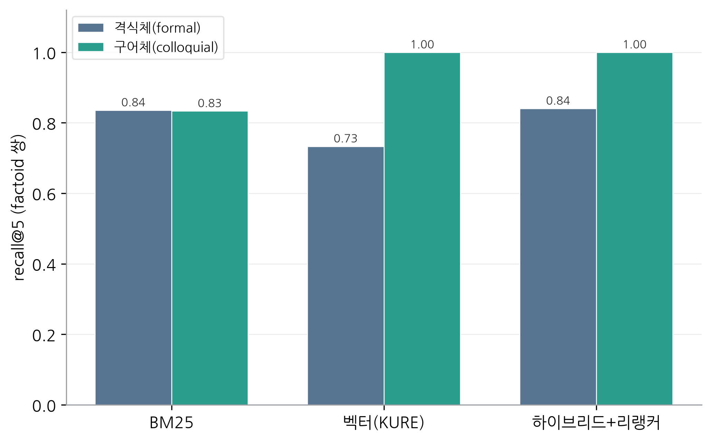
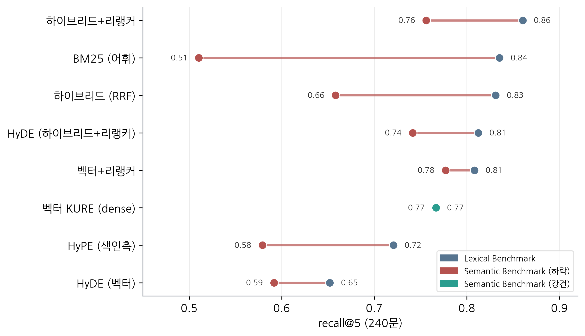
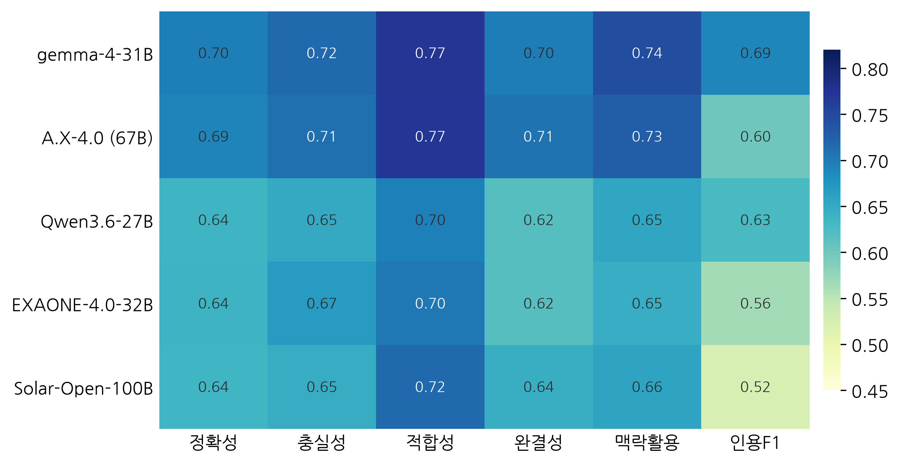

# KA-013-KFinLaw-MCP

**한국 금융 법령으로 한국어 RAG 검색 기법을 정량 비교·평가**하고,
**국가법령정보센터 연계 MCP/CLI**를 구축하는 KFTC 연구 과제.

`최종 업데이트 2026-06-17`

[**Highlights**](#highlights) · [1. Introduction](#1-introduction) · [2. KFinLaw with RAG](#2-kfinlaw-with-rag) · [3. KFinLaw with MCP](#3-kfinlaw-with-mcp) · [4. KFinLaw with CLI](#4-kfinlaw-with-cli) · [References](#references)

---

## Highlights

> [!IMPORTANT]
> **핵심 결론** — 한국 금융 법령 RAG 검색·답변 벤치마크 측정 결과 (Lexical 240문 + Semantic 240문)
>
> - ✅ **검색은 '하이브리드 + 리랭커'가 정답.** 문서를 조·섹션 단위로 자르고, 키워드 검색(BM25)과 의미 검색(KURE 임베딩)을 함께 쓴 뒤 리랭커로 재정렬하면 정답 회수율(recall@5)이 0.86 수준으로 가장 높다. 특히 **리랭커 적용이 성능을 가장 크게 끌어올리는 단일 요소**이며, 리랭커 모델 간 차이는 작다(평균 ±0.02). (표 1)
> - ✅ **한국어 의미 임베딩은 KURE-v1이 최선** (KoE5·BGE-M3보다 우수). 다만 의미 검색만으로는 부족해 — 법령명·조문번호·표처럼 정확한 단어 일치가 중요한 질문은 키워드 검색(BM25)이 더 강하다 — 둘을 합친 하이브리드가 가장 안정적이다.
> - ❌ **'정교한' 증강 기법은 오히려 손해.** 가설 질문(HyPE)·가설 답변(HyDE)·지식그래프(LightRAG) 세 가지 모두 기본 구성보다 낮았다. 정교하다고 더 좋은 게 아니므로 **새 데이터에 도입하기 전 반드시 직접 측정**해야 한다. (그림 5)
> - ✅ **답변 생성 LLM은 크기보다 도메인 적합성.** 같은 검색·프롬프트 조건에서 31B급 gemma-4가 100B(Solar)·67B(A.X)보다 더 나은 답을 냈다. 무작정 큰 모델보다 한국어·도메인에 맞는 중형을 실측 비교해 고르는 편이 낫다. (그림 8)
> - 🔬 **어휘중첩 편향까지 검증.** 질문을 일상어로 바꾼 두 번째 벤치마크(Semantic)에선 BM25가 붕괴(0.835→0.510)하고 dense 검색은 끄떡없어(0.767→0.767) **최적 조합이 '벡터+리랭커'로 바뀐다**. 단, 증강 기법(HyPE·HyDE·LightRAG)의 열위는 여기서도 그대로다. (그림 7)
> - 📍 **위치 지정 질의는 RAG의 약점.** "○○법 제5조"처럼 조 위치를 직접 묻는 known-item 질의(Locator)에선 BM25·dense 모두 약하고(최고 recall 0.66) 리랭커가 결정적이다 — RAG보다 **구조적 조회**가 맞는 영역(목적2 MCP/CLI의 근거). (표 7)

---

## 1. Introduction

| | 목적 | 방향 |
|---|---|---|
| 1 | **한국 금융 법령 RAG 검색 기법 비교·평가** | 청킹·임베딩·검색기·리랭커·증강기법을 통제 실험으로 정량 비교. 산출물은 **기법별 정량 검증·문서화** |
| 2 | 국가법령정보센터 **MCP/CLI** (Claude 호환) | `law.go.kr` 라이브 API(검색·조문·별표·인용검증), 경량·신선도 우선 |

작업 순서는 벤치마크(목적1, [§2](#2-kfinlaw-with-rag)) → MCP([§3](#3-kfinlaw-with-mcp))·CLI([§4](#4-kfinlaw-with-cli)).

---

## 2. KFinLaw with RAG

한국 금융 법령 위에서 RAG 검색·답변 기법을 통제 실험으로 비교한다. 파이프라인 구성요소(§2.1)와 벤치마크 데이터(§2.2)를 정의하고, 평가 방법론(§2.3)에 따라 결과(§2.4)를 도출하며, 재현 절차(§2.5)를 제공한다.

### 2.1 Pipeline Components

파이프라인 단계별로 아래 선택지를 바꿔가며 비교했다(일변수 격리). 검색 결과는 질문유형(factoid·crossref·byeolpyo·multihop)과 register(격식체/구어체)별로도 분해해 기법의 강·약점을 살핀다.

| 단계 | 비교한 선택지 |
|---|---|
| 파싱 | 별표 소스 — kordoc-md · 평문 · MinerU(미연결) |
| 청킹 | 조 · 항 · 고정토큰 · 계층(parent-doc) |
| 임베딩 | KURE-v1[[8]](#ref8) · BGE-M3[[7]](#ref7) · KoE5[[6]](#ref6) |
| 검색기 | BM25[[2]](#ref2) · dense[[3]](#ref3) · 하이브리드 RRF[[4]](#ref4) · LightRAG[[11]](#ref11) |
| 재순위 | 적용 여부 + 리랭커 4종 (bge-reranker-v2-m3[[5]](#ref5) · ko-reranker · ko-reranker-8k · bge-reranker-large) |
| 증강 | HyPE(색인측)[[10]](#ref10) · HyDE(질의측)[[9]](#ref9) |
| 답변 생성 | 답변모델 5종 · 컨텍스트 포맷 · 인용 지시 |

또한 골드셋 생성기·judge·답변모델 3개 역할을 서로 다른 계열로 분리하며(생성기·judge가 답변모델과 같으면 self-enhancement·preference leakage가 생긴다), 모든 모델은 temp=0으로 실행한다.

| 역할 | 모델 (크기) | 용도 |
|---|---|---|
| 생성기 | Mistral Small 4 (119B) | 골드셋·HyPE/HyDE 질의 생성 — 독립 계열, 한국어·별표 우수 |
| 심사기 | gpt-oss-120b | 답변 채점(judge) — 생성기·답변모델과 다른 계열로 오염 방지 |
| 답변모델 | <ul><li>Qwen3.6 (27B)</li><li>gemma-4 (31B)</li><li>EXAONE-4.0 (32B)</li><li>A.X-4.0 (67B)</li><li>Solar-Open (100B)</li></ul> | 답변 평가([§2.4.2](#242-answer-evaluation)) 비교 대상 5종 |

### 2.2 Benchmark

#### 2.2.1 데이터 소스 · 인증키

국가법령정보센터 Open API(<https://open.law.go.kr>)를 사용한다. 검색은 `lawSearch.do`, 본문은 `lawService.do`, 별표서식은 `target=licbyl`로 접근한다. 인증키(OC)는 코드에 하드코딩하지 않고 사용자별로 발급·설정한다 — 회원가입 후 OPEN API를 신청해 OC를 발급받고 `export LAW_OC=<키>`로 지정하면 된다.

#### 2.2.2 수집 · 전처리

`collect_laws.py`가 금융 키워드 28개로 현행 법령 200건을 찾고, 인용된 법령을 재귀적으로 따라가 총 2,596건(본문 XML 2,582개)을 수집한다. 이 중 키워드 1차와 직접참조에 해당하는 931건만 금융 범위로 확정하고, 재귀로 딸려온 비금융 법령은 제외한다. `lawdoc.py`는 XML을 조 단위 청크로 전처리하며, 식별자는 조문 `{법령ID}-{조문번호:04d}{-가지}`·별표 `{법령ID}-별표{번호}{-가지}` 규칙을 따른다.

별표(부록·표)는 PDF로 변환했다. API가 주는 HTML은 JS iframe이라 직접 스크래핑이 안 되고, 원본 HWP는 표 구조가 퇴화하기 때문이다. 변환기는 GPU가 필요 없고 라이선스가 자유로운 **kordoc**(PDF 모드)을 기본으로 쓰되, 병합셀이 복잡한 표만 MinerU로 폴백한다 — 1,083개를 전수 변환했다.

#### 2.2.3 코퍼스

핵심 금융법 **32개 법령(13개 법령군)**. 각 군이 본법 + 시행령(+ 시행규칙)을 갖춰 법↔시행령 멀티홉·별표 조회·교차참조를 모두 평가하도록 통제한 소규모 구성이다.

<details>
<summary>대표 코퍼스 32개 법령 목록 (13군)</summary>

| # | 법령군 | 구성 |
|---|---|---|
| 1 | 전자금융거래법 | 본법 · 시행령 |
| 2 | 자본시장과 금융투자업에 관한 법률 | 본법 · 시행령 · 시행규칙 |
| 3 | 은행법 | 본법 · 시행령 |
| 4 | 금융소비자 보호에 관한 법률 | 본법 · 시행령 |
| 5 | 금융실명거래 및 비밀보장에 관한 법률 | 본법 · 시행령 · 시행규칙 |
| 6 | 금융지주회사법 | 본법 · 시행령 |
| 7 | 여신전문금융업법 | 본법 · 시행령 · 시행규칙 |
| 8 | 보험업법 | 본법 · 시행령 · 시행규칙 |
| 9 | 신용정보의 이용 및 보호에 관한 법률 | 본법 · 시행령 · 시행규칙 |
| 10 | 대부업 등의 등록 및 금융이용자 보호에 관한 법률 | 본법 · 시행령 |
| 11 | 금융회사의 지배구조에 관한 법률 | 본법 · 시행령 |
| 12 | 예금자보호법 | 본법 · 시행령 |
| 13 | 상호저축은행법 | 본법 · 시행령 · 시행규칙 |

> 본법 13 + 시행령 13 + 시행규칙 6 = **32개**. 전자금융·자본시장·은행·보험·여신·신용정보·예금보호·지배구조·실명거래 등 핵심 영역을 포괄. 전체 메타(mst·법령ID·조문수·별표수)는 `benchmark/corpus_ids.json`.

</details>

#### 2.2.4 골드셋

코퍼스(약 3,251 청크)에서 평가용 **240문**을 반자동으로 만들었다. 생성기 Mistral Small 4가 각 조문·별표에서 Q&A를 만들고, **일관성 필터**로 걸러 채택한다 — 생성된 질문을 검색기에 다시 넣어 원본 조문이 회수되는 질문만 남기는 방식이다(round-trip BM25).

질문은 네 유형을 각 60문씩 균형 있게 두었다: factoid(정의·요건), crossref(교차참조), byeolpyo(별표 조회), multihop(본법↔시행령). 정답 근거(gold)는 조문·별표 uid로 고정했고, multihop 60문은 본법·시행령 둘을 함께 짚는 2-gold다. factoid에는 같은 사실을 격식체·구어체로 묻는 30쌍을 넣어 어휘격차를 짝지어 측정한다. gold uid 300개가 모두 코퍼스에 존재함을 확인했다.

이 240문은 조문 용어가 자연스럽게 섞여 어휘중첩이 큰 **Lexical Benchmark**다. 검색기가 표면 어휘중첩에 얼마나 의존하는지 가리기 위해, 같은 코퍼스·유형 분포에서 전문용어를 일상어로 풀어 어휘격차를 크게 만든 **Semantic Benchmark**(240문)를 짝으로 둔다. 또 사용자가 조 위치를 직접 지정하는 known-item 질의("○○법 제5조")는 성격이 달라 **Locator Benchmark**(103문, 결정론 생성)로 따로 다룬다. 세 벤치마크는 모두 동일한 골드셋 스키마를 따르며, 구축·평가 결과는 [§2.4.1](#241-retrieval-evaluation)에서 다룬다.

<details>
<summary>골드셋 방법론 근거</summary>

검색 골드셋은 정답이 ID라 LLM-judge 편향과 무관하므로 오픈웨이트 생성기로 만들어도 충분하다(InPars[[12]](#ref12); InPars-v2[[13]](#ref13)). 다만 생성기·judge·답변모델은 서로 다른 계열로 분리해 선호 누출(preference leakage)을 피했고, 품질의 핵심 장치는 일관성 필터(Promptagator[[14]](#ref14))다 — 생성된 질문을 검색기에 다시 넣어 원본 조문이 회수되는 질문만 채택한다. 한 가지 주의로, BM25가 구어체를 과소평가할 수 있어 factoid 쌍은 격식체로 일관성을 검사하되 같은 정답을 공유하는 구어체도 함께 채택했다.

**Semantic Benchmark**는 검색기 무관 결정론적 필터로 거른다 — 코퍼스 문자 4-gram의 문서빈도(DF)로 '희소 용어'를 판정해, 질문이 정답 조문의 희소 4-gram을 재사용하면 폐기한다(생성 시도의 31%가 누출로 폐기). BM25 일관성 필터를 쓰지 않아 어휘중첩 편향이 재유입되지 않는다. **Locator Benchmark**는 LLM 없이 코퍼스 조문에서 직접 생성한다 — L1 단일 조(40) · L2 조 범위(23, 멀티-gold) · L3 법령명 생략·모호(40).

</details>

### 2.3 Evaluation Methodology

먼저 검색 평가를 최적화해 그 구성을 고정한 뒤, 그 위에서 답변 생성 평가를 수행하는 **2단계 파이프라인**이다. 변수는 한 번에 하나씩만 바꾸고 나머지는 고정해(OFAT), 각 기법이 성능에 주는 영향을 분리해서 살펴본다.


> **그림 1.** 방법론 개요 — 데이터(코퍼스·골드셋) → ① 검색 평가 → (최적 config 고정) → ② 답변 평가.

**검색 메트릭**(`benchmark/eval/retrieval_metrics`)은 회수된 청크의 uid를 gold uid와 대조해 recall@k · precision@k · MRR · nDCG@k[[15]](#ref15)를 **결정론적으로** 계산하므로 LLM 판정이 개입하지 않는다.

**답변 메트릭**(`answer_metrics`)은 인용 정확도만 자동·객관이고, 나머지 다섯 항목은 judge 루브릭으로 채점한다. judge는 답변모델과 다른 계열(gpt-oss-120b, temp=0)이며, 검색은 최적 config(하이브리드+리랭커)로 고정해 답변모델 효과만 본다.

| 메트릭 | 측정 | 채점 |
|---|---|---|
| answer correctness | 정답과 일치 | judge (레퍼런스 기반: 정답+정답조문 제공) |
| faithfulness | 답이 회수 컨텍스트에 근거(환각 없음) | judge |
| answer relevancy | 질문에 답하는가 | judge |
| completeness | 요건/항목 누락 없는가 | judge |
| context utilization | 회수 컨텍스트를 실제 활용 | judge |
| citation accuracy | 인용 조문이 gold_ids와 일치 | 자동 (LLM 불필요) |

<details>
<summary>RAGAS 대응 · 고유 비교 축 · 엄밀성</summary>

**RAGAS 대응 (정렬했으나 라이브러리 비채택).** RAGAS[[16]](#ref16)는 RAG 평가의 사실상 표준이다(reference-free LLM 자동채점). 우리 메트릭도 그 분류에 의도적으로 맞췄다. 다만 라이브러리는 쓰지 않고 직접 구현했는데, ① gold(정답·정답조문 uid)로 레퍼런스 기반의 더 엄밀한 채점, ② judge 계열 강제 분리, ③ 조문 uid 인용검증·한국어 프롬프트 직접 통제를 위해서다.

| 우리(`answer_metrics`) | RAGAS | 차이 |
|---|---|---|
| faithfulness / answer relevancy / context utilization | 동일 | 동일 개념 |
| answer correctness | answer correctness | 둘 다 레퍼런스 필요 |
| completeness | (표준 없음, context recall 근접) | 커스텀 |
| citation accuracy | (없음) | 조문 uid 일치, 자동·도메인 특화 |

검색 평가의 recall@k·nDCG는 uid 기반 결정론 채점이라 RAGAS의 LLM 판정 context precision/recall보다 객관적이다.

**고유 비교 축.** ① 답변모델 5종 비교(동일 검색·프롬프트), ② 검색품질 → 답변품질 전이(하이브리드+리랭커 vs 단일 BM25 top-1), ③ closed-book 대조(컨텍스트 없이 vs RAG[[1]](#ref1)), ④ 프롬프트 변형(인용지시·포맷·거부유도).

**엄밀성.** judge 독립성(답변모델과 다른 계열 — 같으면 자기우대 +10~25%), 레퍼런스 기반 채점(judge에 정답+정답조문 제공), 인간(법률가) 표본 검수 ~150문 + 일치계수(κ) 보고(ARES[[17]](#ref17)·KBL[[18]](#ref18) 관행)는 향후 과제다.

</details>

### 2.4 Results

#### 2.4.1 Retrieval Evaluation

청킹·임베딩·검색기·리랭커·증강을 바꿔가며 정보요구형 두 벤치마크(**Lexical · Semantic**)에서 회수 성능을 측정했다. 청킹은 조(條) 단위로, 임베딩은 KURE-v1으로 고정하고 나머지를 변화시켰으며, 모든 검색 구성을 recall@5 · MRR · nDCG@10으로 평가했다.

##### 종합 순위

> **표 1.** 종합 리더보드 — 검색 구성별 Lexical·Semantic의 recall@5·MRR·nDCG@10 (평균 recall@5 순).

| # | 검색기 | 리랭커 | 증강 | **Lexical**<br>R@5 | MRR | nDCG | **Semantic**<br>R@5 | MRR | nDCG | 평균<br>R@5 |
|:-:|---|:-:|:-:|:-:|:-:|:-:|:-:|:-:|:-:|:-:|
| 1 🏆 | 하이브리드(BM25+KURE) | bge-reranker-v2-m3 | — | 0.860 | 0.775 | 0.793 | 0.756 | 0.661 | 0.684 | **0.808** |
| 2 | 하이브리드(BM25+KURE) | ko-reranker | — | 0.838 | 0.729 | 0.754 | 0.769 | 0.672 | 0.691 | **0.803** |
| 3 | 벡터(KURE) | bge-reranker-v2-m3 | — | 0.808 | 0.748 | 0.751 | 0.777 | 0.661 | 0.684 | **0.793** |
| 4 | 하이브리드(BM25+KURE) | ko-reranker-8k | — | 0.863 | 0.785 | 0.804 | 0.708 | 0.608 | 0.637 | **0.785** |
| 5 | 하이브리드(BM25+KURE) | bge-reranker-v2-m3 | HyDE | 0.812 | 0.743 | 0.750 | 0.742 | 0.657 | 0.669 | **0.777** |
| 6 | 벡터(KURE) | — | — | 0.767 | 0.656 | 0.672 | 0.767 | 0.612 | 0.648 | **0.767** |
| 7 | 하이브리드(BM25+KURE) | bge-reranker-large | — | 0.798 | 0.699 | 0.719 | 0.729 | 0.621 | 0.644 | **0.764** |
| 8 | LightRAG(naive) | — | — | 0.738 | 0.639 | 0.648 | 0.767 | 0.616 | 0.649 | **0.752** |
| 9 | 하이브리드(BM25+KURE) | — | — | 0.831 | 0.710 | 0.735 | 0.658 | 0.562 | 0.588 | **0.745** |
| 10 | 벡터(KURE) | bge-reranker-v2-m3 | HyDE+HyPE | 0.721 | 0.680 | 0.672 | 0.667 | 0.588 | 0.595 | **0.694** |
| 11 | BM25 | — | — | 0.835 | 0.707 | 0.741 | 0.510 | 0.397 | 0.430 | **0.673** |
| 12 | LightRAG(mix) | — | — | 0.665 | 0.606 | 0.616 | 0.665 | 0.552 | 0.572 | **0.665** |
| 13 | 벡터(KURE) | — | HyPE | 0.721 | 0.622 | 0.637 | 0.579 | 0.500 | 0.521 | **0.650** |
| 14 | 벡터(KURE) | — | HyDE | 0.652 | 0.558 | 0.572 | 0.592 | 0.469 | 0.499 | **0.622** |
| 15 | 벡터(KURE) | — | HyDE+HyPE | 0.562 | 0.515 | 0.529 | 0.490 | 0.382 | 0.416 | **0.526** |

> **하이브리드+리랭커가 두 벤치마크·전 메트릭에서 고르게 상위.** 증강(HyDE·HyPE·LightRAG)은 모두 자기 baseline 아래다. 리랭커 4종 중 ko-reranker-8k는 Lexical 최고지만 Semantic 급락 — 평균이 가장 균형 잡힌 **bge-reranker-v2-m3가 기본값(🏆)** 이다.

##### 비교축별 분석

변수를 하나씩 격리해(OFAT) 각 축의 기여를 분리했다. 축별 결론·근거는 아래 표에, 청킹·검색기·증강의 분해는 이어지는 그림에 있다.

> **표 2.** 비교축별 결과 요약 — 축별 결론과 근거 (Lexical).

| 비교 축 | 결론 | 근거 |
|---|---|---|
| 청킹 | **조(條) 단위 최적** | BM25·벡터 양쪽 최고 (fixed는 벡터에 불리, parent-doc는 벡터 랭킹↑) |
| 임베딩 | **KURE-v1 최적** | KURE-v1 > KoE5 > BGE-M3 (한국어 특화) |
| 검색기·리랭커 | **하이브리드 + 리랭커** 🏆 | 리랭커가 단일 최대 레버 (crossref 0.48→0.73) |
| 별표 소스 | kordoc-md 근소 우위 | 별표 recall@5 0.950 vs 평문 0.900 (표구조 보존 +5pp, MRR·nDCG는 동급) |
| 증강 (HyDE·HyPE) | **효과 없음** ❌ | 전 dense 기저에서 baseline 미달(↓ 그리드), 둘을 겹치면 최악 |
| LightRAG | **효과 없음** ❌ | 그래프 모드가 naive(순수 벡터 검색)보다 낮아 그래프화가 역효과, 평균 순위도 단일 벡터 아래(표 1) |

| | |
|---|---|
|  |  |
|  |  |

> **그림 2.** 청킹 단위별 recall@5. &nbsp; **그림 3.** 검색기 × 질문유형별 recall@5.
> **그림 4.** 컴포넌트 누적 recall@k. &nbsp; **그림 5.** 증강 기법 vs baseline.

증강(HyDE·HyPE·LightRAG)은 어느 기저에서도 baseline을 넘지 못했다 — 그림 5처럼 전 칸이 기저 미만이고, HyDE+HyPE 중첩이 가장 나쁘다. 세부 수치는 아래에 펼쳐 둔다.

<details>
<summary>세부 수치 — 증강 그리드 · 검색기 × 질문유형 · LightRAG 모드별</summary>

> **표 3.** 증강 그리드 — HyDE·HyPE를 dense 기저별로 적용한 recall@5 (Lexical). 모든 칸이 기저(none)보다 낮다.

| 기저 | none | +HyDE | +HyPE | +HyDE+HyPE |
|---|:-:|:-:|:-:|:-:|
| 벡터(KURE) | **0.767** | 0.652 | 0.721 | 0.562 |
| 벡터 + 리랭커 | **0.808** | 0.758 | 0.735 | 0.721 |
| 하이브리드(BM25+KURE) | **0.831** | 0.671 | — | — |
| 하이브리드 + 리랭커 | **0.860** | 0.812 | — | — |

리랭커가 손상을 크게 복구하지만(예: 벡터+HyDE 0.652→0.758) 여전히 기저 미만이고, **HyDE+HyPE 중첩이 가장 나쁘다**(0.562). HyPE는 색인을 가설질문 임베딩으로 교체하는 구조라 BM25 성분이 있는 하이브리드와는 결합되지 않는다(—).

검색기 × 질문유형 (조청킹, recall@5)

| 유형 | BM25 | 벡터(KURE) | 해석 |
|---|---|---|---|
| factoid | 0.900 | 1.000 | 의미 질문은 dense 우위 |
| crossref | 0.750 | 0.483 | 법령명 어휘 매칭 → BM25 강함 (최난도) |
| byeolpyo | 0.950 | 0.883 | 별표 수치·항목 |
| multihop | 0.742 | 0.700 | 본법+시행령 2-gold |

LightRAG 모드별 (recall@5 / MRR / nDCG@10)

| 모드 | recall@5 | MRR | nDCG@10 |
|---|---|---|---|
| naive (벡터only) | 0.738 | 0.639 | 0.648 |
| mix | 0.665 | 0.606 | 0.616 |
| hybrid | 0.644 | 0.593 | 0.597 |
| global | 0.585 | 0.554 | 0.558 |
| local | 0.463 | 0.430 | 0.430 |

그래프 증강 모드가 모두 naive보다 낮다 — 엔티티 그래프가 chunk recall을 오히려 희석한다. crossref(최고 0.467 vs BM25 0.750)·multihop에서도 기대한 이득이 없다. (LightRAG 자체 청킹 1200자 + uid 역매핑 근사로 일부 과소평가 가능하나 격차가 커 결론은 견고.)

</details>

##### Lexical vs Semantic — 어휘중첩 편향 검증

§2.2의 Lexical Benchmark는 조문에서 질문을 만들고 BM25 일관성 필터로 거르므로, 질문이 조문 용어를 그대로 쓰는(어휘중첩이 큰) 쪽으로 치우친다. 실제로 구어체 질문조차 격식체와 비슷하거나 더 쉽게 검색됐는데(벡터 KURE 격식 0.733 vs 구어 1.000, 그림 6), 질의–조문 어휘격차가 애초에 작았다는 신호다. 그렇다면 BM25 우위나 HyPE·HyDE 무용이 이 편향의 산물일 수 있다 — 이를 가리려 일상어로 풀어 어휘격차를 키운 **Semantic Benchmark**를 만들었다(생성·필터는 §2.2).



> **그림 6.** factoid 격식체·구어체 쌍의 검색기별 recall@5.

같은 조문(예금자보호법 시행령 제16조의4, 특별기여금 연체료)을 두 벤치마크가 어떻게 다르게 묻는지 — 굵게가 서로 대비되는 표현이다.

> **표 4.** Lexical vs Semantic 질문 예시 (동일 조문).

| 벤치마크 | 질문 (정답 조문 동일) |
|---|---|
| **Lexical** | 부보금융회사가 **예금보험기금채권상환특별기여금**을 납부기한 내에 내지 않으면 부과되는 **연체료**의 산정 기준은? |
| **Semantic** | **예금보험 관련 기금**을 갚기 위한 **특별 부담금**을 제때 못 내면, 그다음 날부터 얼마를 더 내야 하나요? |

Lexical은 조문의 정식 용어(`예금보험기금채권상환특별기여금`·`부보금융회사`·`연체료`)를 그대로 써 BM25가 단어만 맞춰도 정답을 찾지만, Semantic은 같은 사실을 일상어(`예금보험 관련 기금`·`특별 부담금`)로 풀어 의미를 이해하는 dense 검색이라야 회수된다.



> **그림 7.** 동일 기법의 Lexical→Semantic recall@5 변화(점=벤치마크, 선 길이=변화 크기).

> **표 5.** 검색 재평가 — Lexical→Semantic recall@5 변화 (Semantic 순).

| 구성 | Lexical | **Semantic** | Δ |
|---|---|---|---|
| 벡터 + 리랭커 *(Semantic 최적)* | 0.808 | **0.777** | −0.031 |
| 벡터 KURE (dense) | 0.767 | 0.767 | ±0.000 |
| 하이브리드 + 리랭커 *(Lexical 최적)* | 0.860 | 0.756 | −0.104 |
| 임베더 KoE5 (벡터) | 0.710 | 0.756 | **+0.046** |
| LightRAG (mix 모드) | 0.665 | 0.665 | ±0.000 |
| HyDE (질의측 증강) | 0.652 | 0.592 | −0.060 |
| HyPE (색인측 증강) | 0.721 | 0.579 | −0.142 |
| BM25 (어휘) | 0.835 | 0.510 | **−0.325** |

- **BM25는 붕괴(−39%), dense는 변화 없음 → 순위 역전.** 어휘격차가 큰 현실적 질의에선 dense가 BM25를 크게 앞선다. Lexical Benchmark의 BM25 우위는 상당 부분 어휘중첩 인공물이었다.
- **최적 조합이 뒤바뀐다.** Lexical 최적은 하이브리드+리랭커지만 Semantic 최적은 **벡터+리랭커** — 하이브리드는 BM25 성분이 어휘격차에서 발목을 잡아 밀린다.
- **임베더 강건성 차이.** KoE5가 어휘격차에 가장 강건(임베더 중 유일하게 상승, +0.046), KURE는 최고 성능을 그대로 유지(±0).
- **증강 부정 결과는 두 벤치마크 모두에서 견고하다.** HyPE·HyDE·LightRAG는 Semantic에서도 단순 벡터에 못 미친다 — "정교한 증강이 효과 없다"는 결론은 골드셋 편향 탓이 아니다.

**적용 권고.** 사용자 질의가 법령 용어와 가까우면(어휘중첩↑) 하이브리드+리랭커가, 일상어 위주면(어휘격차↑) 벡터+리랭커가 유리하다. 실제 질의 분포를 모르면 둘을 모두 갖춘 하이브리드+리랭커가 안전한 기본값이되, 어휘격차가 큰 도메인일수록 BM25 가중을 낮추는 편이 낫다.

##### Locator — 조문 위치 질의

"○○법 제5조", "제5조부터 제8조까지"처럼 사용자가 **위치(법령명+조번호)를 이미 알고** 그 조문을 찾는 known-item 질의다. 정보요구형(Lexical·Semantic)과 달리 정답이 위치로 특정되며, dense 검색의 '정확 식별자' 처리력을 본다.

> **표 6.** Locator 질문 유형 예시.

| 유형 | 예시 질문 | gold |
|---|---|---|
| L1 단일 조 | 여신전문금융업법 **제54조**에는 어떤 내용이 규정되어 있나요? | 그 조문 1개 |
| L2 조 범위 | 보험업법 **제51조부터 제55조까지**에는 무엇이 규정되어 있나요? | 5개 조문 |
| L3 법령명 생략 | **제111조**에는 어떤 내용이 규정되어 있나요? | 코퍼스 내 '제111조' 전부 |

> **표 7.** Locator 검색 결과 — 검색기별·유형별 recall@5.

| 검색기 (recall@5) | 전체 | 단일 조 | 조 범위 | 법령명 생략 |
|---|:-:|:-:|:-:|:-:|
| BM25 | 0.197 | 0.325 | 0.069 | 0.141 |
| 벡터(KURE) | 0.376 | 0.525 | 0.130 | 0.367 |
| 하이브리드(BM25+KURE) | 0.443 | 0.650 | 0.163 | 0.398 |
| **하이브리드 + 리랭커** | **0.660** | **0.850** | **0.311** | 0.670 |
| 벡터 + 리랭커 | 0.626 | 0.800 | 0.232 | **0.678** |

- **BM25가 최악(0.197).** 일반 IR 직관("정확 ID는 BM25 강")과 반대다 — 법령 코퍼스는 법령명이 그 법의 모든 조문에 반복되고 "제N조"가 교차참조로 도처에 나와, **식별자 토큰이 비(非)-distinctive**해 BM25 신호가 무뎌진다.
- **리랭커가 결정적.** 크로스인코더가 브레드크럼("[법령명 > 제N조]")을 통째로 읽어 정확 매칭 → 0.20→0.66, 단일 조는 0.85까지.
- **범위 질의가 가장 어렵다**(멀티-gold, 최고 0.31). 연속 조문을 top-k에 모두 담기 어렵다.
- **전체 회수율이 낮다**(최고 0.66). locator는 RAG 검색보다 **구조적 조회**(법령명+조번호 파싱 → 직접 fetch)가 정답이며, 이것이 [목적2 MCP/CLI](#1-introduction)의 직접적 근거다.

#### 2.4.2 Answer Evaluation

검색을 최적 config(하이브리드+리랭커)로 고정하고 답변모델만 바꿔, 검색이 찾은 근거 위에서 만든 답의 품질을 본다(Lexical Benchmark 240문, judge 점수 0~1).

> **표 8.** 답변모델 비교 — 5종 × 6개 메트릭 judge 점수 (Lexical).

| 답변모델 | 정확성 | 충실성 | 적합성 | 완결성 | 맥락활용 | 인용F1 |
|---|---|---|---|---|---|---|
| **google/gemma-4-31B** 🏆 | **0.70** | 0.72 | 0.77 | 0.70 | 0.74 | **0.69** |
| skt/A.X-4.0 (67B) | 0.69 | 0.71 | 0.77 | 0.71 | 0.73 | 0.60 |
| LGAI-EXAONE-4.0-32B | 0.64 | 0.67 | 0.70 | 0.62 | 0.65 | 0.56 |
| Qwen/Qwen3.6-27B | 0.64 | 0.65 | 0.70 | 0.62 | 0.65 | 0.63 |
| upstage/Solar-Open-100B | 0.64 | 0.65 | 0.72 | 0.64 | 0.66 | 0.52 |

**gemma-4-31B가 전 메트릭 최상위**이고 A.X-4.0이 근접한다. 같은 검색·프롬프트 조건에서 31B가 100B(Solar)·67B(A.X)를 능가해, **크기보다 도메인 적합성**이 답변 품질을 좌우한다(검색 실험의 "정교≠우위"와 같은 교훈).



> **그림 8.** 답변모델 5종 × 6개 메트릭 judge 점수 히트맵(진할수록 높음).

**Semantic Benchmark 재평가.** 같은 답변 평가를 Semantic에서 그대로 반복했다(검색은 그 최적인 벡터+리랭커로 고정). **순위는 그대로 — gemma-4-31B 1위·A.X-4.0 2위** 로, 답변모델 선택은 질의 표현에 견고하다. 검색 recall이 낮아진 만큼(0.860→0.777) 답변 품질은 **소폭만 하락**(대부분 −0.03~0.06)해 파이프라인이 어휘격차에서도 끝까지 견딘다. Solar-100B가 가장 크게 하락(−0.056)해 "크기보다 도메인 적합성" 결론이 더 강화됐다.

> **표 9.** 답변 재평가 — Lexical vs Semantic 평균 점수.

| 답변모델 (평균 0~1) | Lexical | Semantic | Δ |
|---|---|---|---|
| **gemma-4-31B** 🏆 | 0.720 | **0.692** | −0.028 |
| A.X-4.0 (67B) | 0.702 | 0.669 | −0.033 |
| Qwen3.6-27B | 0.647 | 0.654 | +0.007 |
| EXAONE-4.0-32B | 0.640 | 0.589 | −0.050 |
| Solar-Open-100B | 0.638 | 0.581 | −0.056 |

**한계.** 통제된 소규모 코퍼스(32법령)라 절대 수치보다 기법 간 상대 비교에 무게를 둔다. 답변 평가는 LLM judge 기반이라 법률가 표본 검수(κ)가, 골드셋은 단일 생성기(Mistral)라 다중 생성기 교차검증이 향후 과제이며, 시행일자 버전·no-answer 유형은 아직 포함하지 않았다.

### 2.5 Reproduction

벤치마크는 `benchmark` 패키지다 — repo 루트에서 `python -m benchmark.<모듈>`로 실행한다(데이터 수집기는 `python scripts/<파일>.py`). 서빙은 전용 venv `/home/work/kftc_model/kfinlaw-serve`(시스템 비오염)에서 `scripts/serve_model.sh {mistral|gptoss|stop}`로 한다. 버전은 `serving/requirements.venv.full.lock`(vllm 0.23.0 등)과 sentence-transformers 5.5.1 / KURE-v1로 박제했다.

```bash
# 1) 데이터 (대용량은 스크립트로 재생성)
export LAW_OC=<본인_인증키>                       # 국가법령정보센터 OC (§2.2 참고)
python scripts/collect_laws.py
python scripts/download_byeolpyo.py --kinds 별표

# 2) 코퍼스 + 골드셋  (vLLM 기동: scripts/serve_model.sh mistral)
python -m benchmark.corpus
python -m benchmark.goldset.build_goldset --reasoning-effort none --no-judge

# 3) 검색 실험
python -m benchmark.retrieval_runner --chunker article --retriever hybrid --rerank \
    --embedder kure-v1 --byeolpyo md              # 권장 기본 구성 (recall@5 0.860, 리랭커=bge-m3)
python -m benchmark.retrieval_runner --chunker article --hype --embedder kure-v1 --byeolpyo md   # HyPE
python -m benchmark.hyde_gen --reasoning-effort none                                             # HyDE 캐시
python -m benchmark.retrieval_runner --chunker article --retriever vector --hyde --embedder kure-v1 --byeolpyo md

# 4) LightRAG (GPU 전용 권장 — CUDA graph + 동시성↑로 가속)
EAGER=0 GPU_UTIL=0.7 scripts/serve_model.sh mistral
python -m benchmark.lightrag_index               # 전체 색인 (가속 시 ~80분)
python -m benchmark.lightrag_eval --modes naive local global hybrid mix

# 5) 답변 평가 (답변모델 + 독립 judge 서빙 후)
python -m benchmark.answer_runner --answer-model LGAI-EXAONE/EXAONE-4.0-32B \
    --judge-base-url http://localhost:8001/v1 --judge-model openai/gpt-oss-120b

# 6) Semantic·Locator·리랭커 재실험 (GPU 유휴 게이팅)
scripts/run_semantic_build.sh && scripts/run_semantic_matrix.sh && scripts/run_lightrag_semantic.sh
scripts/run_locator_eval.sh ; scripts/run_reranker_compare.sh

# 7) 결과 figure 생성
python -m benchmark.make_figures
```

<details>
<summary>서빙 플래그·격리·GPU 설정 / 디렉토리 구조</summary>

- 버전 박제: vllm 0.23.0 · mistral_common 1.11.3 (시스템 0.20.1/1.11.2의 reasoning_effort·멀티모달 버그 회피).
- 격리: 셸 `PYTHONPATH`가 시스템 패키지를 오염시키므로 `env -u PYTHONPATH PYTHONNOUSERSITE=1` (serve_model.sh가 자동 적용 + 잔여 워커/shm 정리).
- Mistral 플래그: `--quantization fp8 --reasoning-parser mistral --tool-call-parser mistral --enable-auto-tool-choice --limit-mm-per-prompt '{"image":0}'`, 요청 시 `reasoning_effort="none"`.
- GPU: FP8 + ctx 4096 + `--gpu-memory-utilization`(학습 공존 0.26 / GPU 전용 `GPU_UTIL=0.7`). 디코딩 가속은 `EAGER=0`(CUDA graph), 기본 `EAGER=1`(enforce-eager).

```
KA-013-KFinLaw-MCP/
├── config.yaml                    # 단일 설정 출처(서빙·모델·검색·골드셋·답변 평가)
├── scripts/                       # collect_laws · download_byeolpyo · hwp2pdf · serve_model · run_*.sh
├── benchmark/                     # python -m benchmark.<모듈>
│   ├── common.py · lawdoc.py · corpus.py        # config·유틸 / 파서(조문·별표→uid) / 코퍼스 선정
│   ├── pipeline/                  # chunkers · embedders · retrievers
│   ├── eval/                      # retrieval_metrics · answer_metrics
│   ├── goldset/                   # build_goldset(--lowoverlap) · build_goldset_locator · questions*.jsonl
│   ├── retrieval_runner.py · answer_runner.py   # 검색 / 답변 평가
│   ├── hype_index.py · hyde_gen.py · lightrag_index.py · lightrag_eval.py
│   ├── make_figures.py · figures/ · reports/    # figure 생성 / PNG / 결과 JSON
├── serving/  requirements.venv.lock / .full.lock   # 작동 버전 박제
├── data/ (gitignore)  raw_xml · byeolpyo_pdf · byeolpyo_md
└── tools/ (gitignore) LibreOffice + H2Orestart
```

</details>

---

## 3. KFinLaw with MCP

> 🚧 **계획** (목적2, 미착수)

국가법령정보센터 라이브 API를 **Claude 호환 MCP 서버**로 노출한다. 무거운 RAG 없이 경량·신선도 우선 — 법령 검색, 조문 본문, 별표서식, 인용(교차참조) 검증을 도구로 제공한다. [§2.4.1 Locator](#241-retrieval-evaluation) 결과가 보여주듯 *"○○법 제5조"* 류 위치 지정 질의는 RAG 검색보다 **법령명+조번호 파싱 → 직접 fetch**(구조적 조회)가 정확하므로, MCP는 이 직접 조회를 1차 경로로 삼고 의미 검색(§2의 하이브리드+리랭커)을 보조로 결합한다.

| 도구(예정) | 매핑 |
|---|---|
| `search_law` | `lawSearch.do` |
| `get_article` | `lawService.do` (법령명+조번호 → 조문) |
| `get_byeolpyo` | `target=licbyl` |
| `verify_citation` | 조문 내 「」 참조 해소·존재 검증 |

---

## 4. KFinLaw with CLI

> 🚧 **계획** (목적2, 미착수)

§3의 MCP 도구를 감싸는 경량 **CLI**. 터미널에서 법령 검색·조문 조회·별표 확인·인용 검증을 수행하고, 결과를 표준출력/JSON으로 반환한다(스크립트·파이프라인 연계 용도).

---

## References

본 벤치마크가 채택·검증한 기법의 원천. 본문에서는 번호 링크(예: [[4]](#ref4))로 인용한다.

- <a id="ref1"></a>**[1]** Lewis et al. (2020). *Retrieval-Augmented Generation for Knowledge-Intensive NLP Tasks.* NeurIPS. [arXiv:2005.11401](https://arxiv.org/abs/2005.11401)
- <a id="ref2"></a>**[2]** Robertson & Zaragoza (2009). *The Probabilistic Relevance Framework: BM25 and Beyond.* Foundations and Trends in IR. [doi:10.1561/1500000019](https://doi.org/10.1561/1500000019)
- <a id="ref3"></a>**[3]** Karpukhin et al. (2020). *Dense Passage Retrieval for Open-Domain Question Answering.* EMNLP. [arXiv:2004.04906](https://arxiv.org/abs/2004.04906)
- <a id="ref4"></a>**[4]** Cormack, Clarke & Büttcher (2009). *Reciprocal Rank Fusion Outperforms Condorcet and Individual Rank Learning Methods.* SIGIR. [doi:10.1145/1571941.1572114](https://doi.org/10.1145/1571941.1572114)
- <a id="ref5"></a>**[5]** Nogueira & Cho (2019). *Passage Re-ranking with BERT.* [arXiv:1901.04085](https://arxiv.org/abs/1901.04085)
- <a id="ref6"></a>**[6]** Wang et al. (2022). *Text Embeddings by Weakly-Supervised Contrastive Pre-training* (E5; KoE5 기반). [arXiv:2212.03533](https://arxiv.org/abs/2212.03533)
- <a id="ref7"></a>**[7]** Chen et al. (2024). *BGE M3-Embedding: Multi-Lingual, Multi-Functionality, Multi-Granularity Text Embeddings* (BGE-M3 · bge-reranker-v2-m3). [arXiv:2402.03216](https://arxiv.org/abs/2402.03216)
- <a id="ref8"></a>**[8]** Jang et al. (2025). *KURE: Embedding Model for Korean-Specific Retrieval* (KURE-v1 · KoE5). Annual Conf. on Human and Language Technology (HCLT), 129–134. [huggingface.co/nlpai-lab/KURE-v1](https://huggingface.co/nlpai-lab/KURE-v1)
- <a id="ref9"></a>**[9]** Gao et al. (2023). *Precise Zero-Shot Dense Retrieval without Relevance Labels* (HyDE). ACL. [arXiv:2212.10496](https://arxiv.org/abs/2212.10496)
- <a id="ref10"></a>**[10]** Vake, Vičič & Tošić (2025). *Bridging the Question-Answer Gap in Retrieval-Augmented Generation: Hypothetical Prompt Embeddings* (HyPE). [SSRN:5139335](https://papers.ssrn.com/sol3/papers.cfm?abstract_id=5139335) · 구현: [NirDiamant/RAG_Techniques](https://github.com/NirDiamant/RAG_Techniques)
- <a id="ref11"></a>**[11]** Guo et al. (2024). *LightRAG: Simple and Fast Retrieval-Augmented Generation.* [arXiv:2410.05779](https://arxiv.org/abs/2410.05779)
- <a id="ref12"></a>**[12]** Bonifacio et al. (2022). *InPars: Data Augmentation for Information Retrieval using LLMs.* SIGIR. [arXiv:2202.05144](https://arxiv.org/abs/2202.05144)
- <a id="ref13"></a>**[13]** Jeronymo et al. (2023). *InPars-v2: Large Language Models as Efficient Dataset Generators for IR.* [arXiv:2301.01820](https://arxiv.org/abs/2301.01820)
- <a id="ref14"></a>**[14]** Dai et al. (2023). *Promptagator: Few-shot Dense Retrieval From 8 Examples.* ICLR. [arXiv:2209.11755](https://arxiv.org/abs/2209.11755)
- <a id="ref15"></a>**[15]** Järvelin & Kekäläinen (2002). *Cumulated Gain-based Evaluation of IR Techniques* (nDCG). ACM TOIS. [doi:10.1145/582415.582418](https://doi.org/10.1145/582415.582418)
- <a id="ref16"></a>**[16]** Es et al. (2024). *RAGAS: Automated Evaluation of Retrieval Augmented Generation.* EACL. [arXiv:2309.15217](https://arxiv.org/abs/2309.15217)
- <a id="ref17"></a>**[17]** Saad-Falcon et al. (2024). *ARES: An Automated Evaluation Framework for Retrieval-Augmented Generation.* NAACL. [arXiv:2311.09476](https://arxiv.org/abs/2311.09476)
- <a id="ref18"></a>**[18]** Kim et al. (2024). *Developing a Pragmatic Benchmark for Assessing Korean Legal Language Understanding in LLMs* (KBL). EMNLP Findings. [arXiv:2410.08731](https://arxiv.org/abs/2410.08731)
