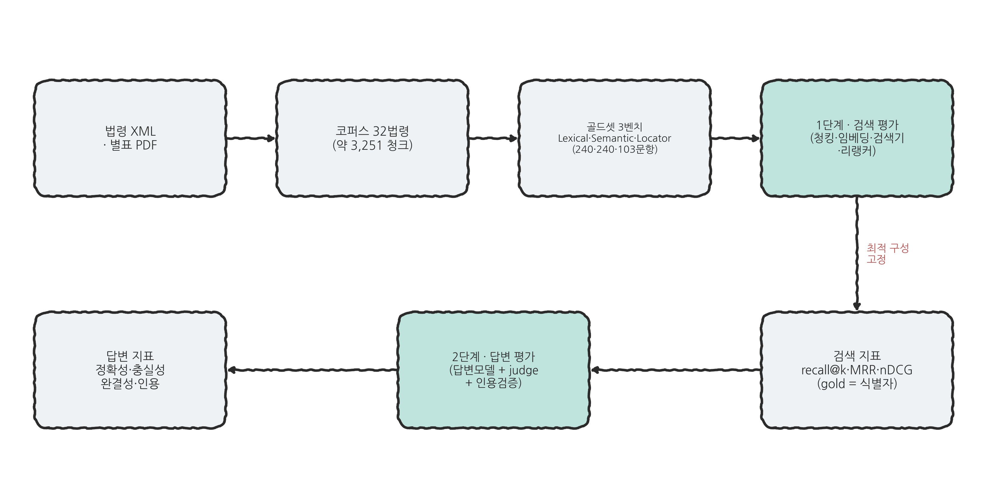
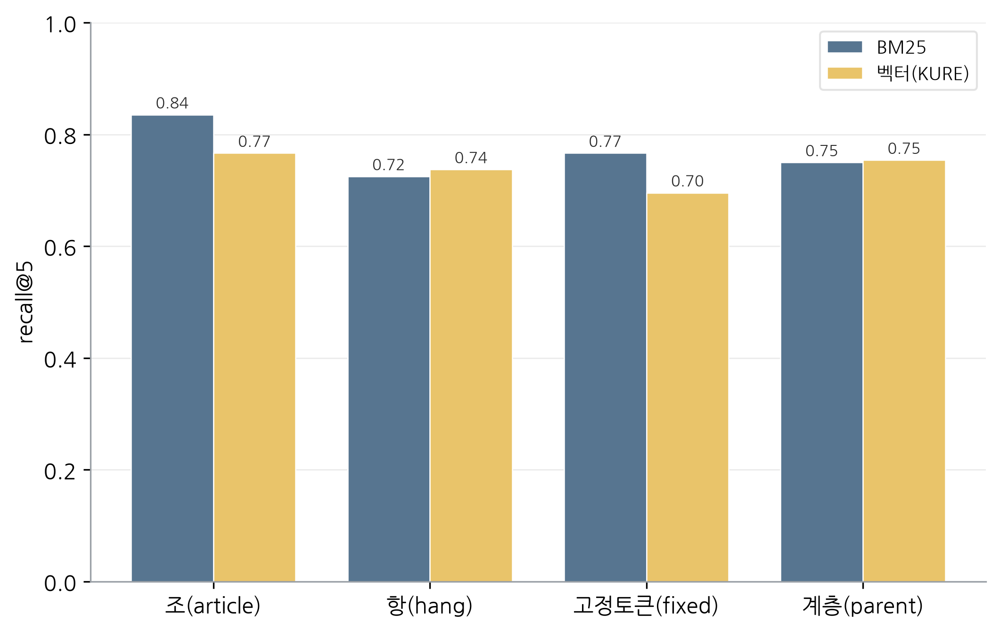
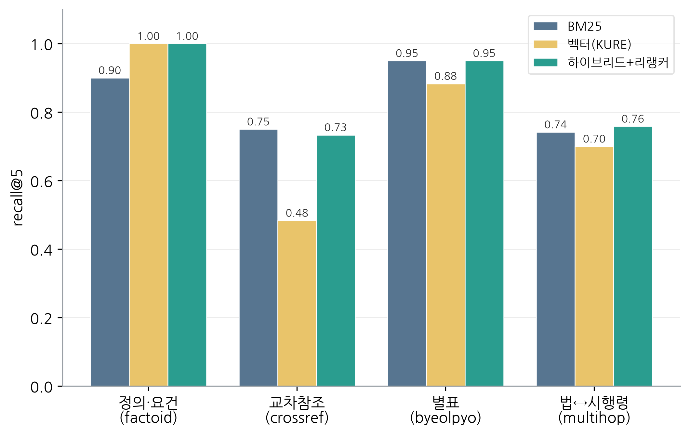
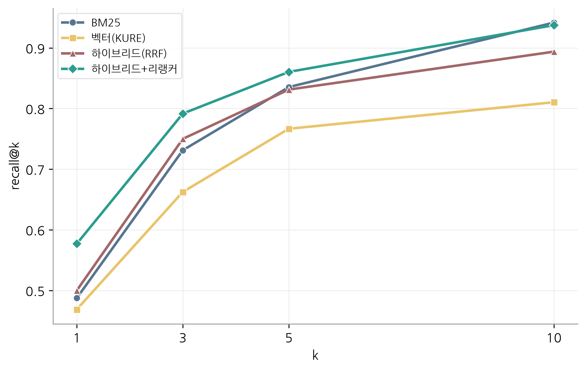
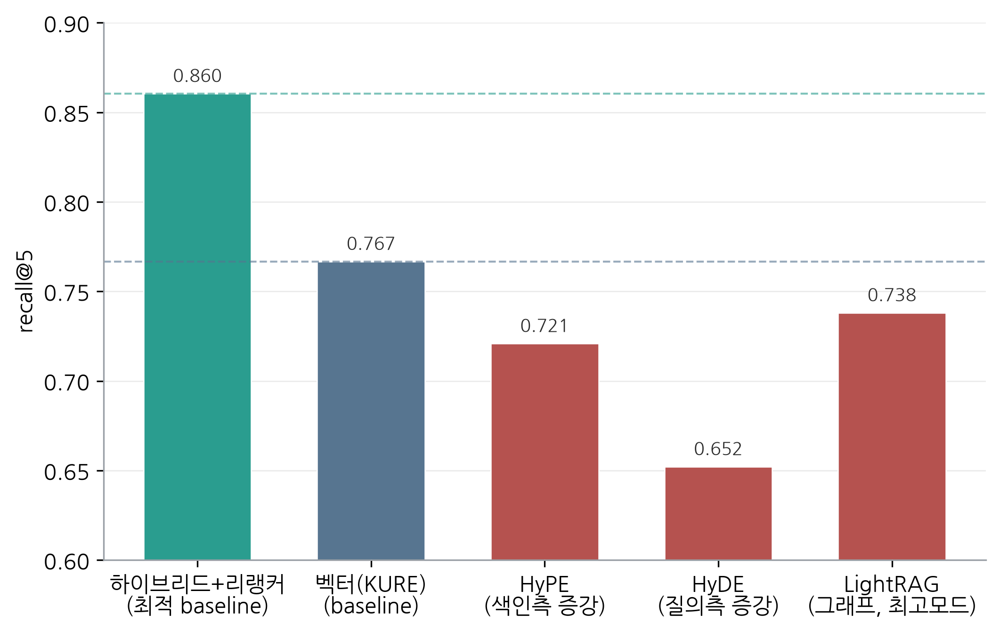
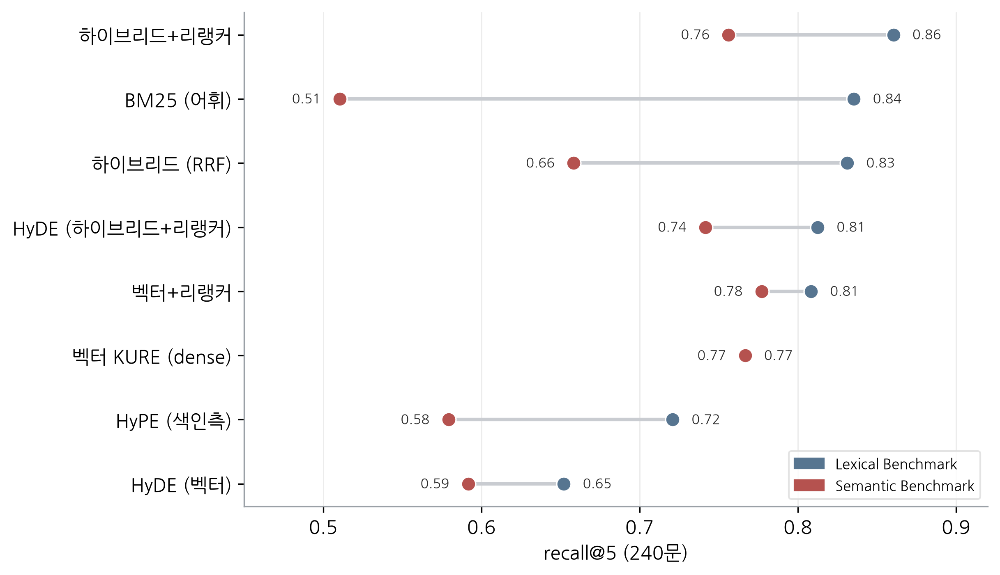

# KA-013-KFinLaw-MCP

**한국 금융 법령으로 한국어 RAG 검색 기법을 정량 비교·평가**하고, 그 결과로
**국가법령정보센터 연계 MCP/CLI를 설계**하는 KFTC 연구 과제.

> **결론 한 줄.** 한국 금융 법령 RAG는 **조 청킹 + KURE-v1 + 하이브리드 + 리랭커**가 최적이며, 인기 증강기법(HyPE·HyDE·LightRAG)은 모두 baseline 미달이다. "○○법 제5조" 류 위치 질의는 RAG가 약해 **구조적 조회(MCP/CLI)**가 정답이다.

`최종 업데이트 2026-06-18`

[**Highlights**](#highlights) · [1. Introduction](#1-introduction) · [2. KFinLaw with RAG](#2-kfinlaw-with-rag) · [3. KFinLaw with MCP](#3-kfinlaw-with-mcp) · [4. KFinLaw with CLI](#4-kfinlaw-with-cli) · [5. Conclusion](#5-conclusion-and-recommendations) · [References](#references)

---

## Highlights

> [!IMPORTANT]
> **핵심 결론** (한국 금융 법령 RAG 검색·답변 벤치마크, Lexical·Semantic 각 240문항)
>
> - ✅ **검색 최적은 하이브리드 + 리랭커**, Lexical recall@5 0.86(평균 0.81). 리랭커 *적용 여부*가 단일 최대 레버(하이브리드 0.831→0.860)이고, 리랭커 *종류* 간 차이는 그보다 작다(평균 R@5 스프레드 약 0.04). (표 1)
> - ✅ **한국어 임베딩은 KURE-v1이 최선** (KoE5·BGE-M3 우위), 정확 어휘 매칭은 BM25가 보완해 하이브리드가 안정적.
> - ❌ **증강(HyPE·HyDE·LightRAG)은 모두 baseline 미달**, "정교 ≠ 우위", 도입 전 실측 필수. (그림 5)
> - ✅ **답변모델은 크기보다 도메인**, 31B gemma-4가 100B(Solar)를 분명히 앞서고 67B(A.X)와는 근소 우위(평균 +0.018). (표 7)
> - 🔬 **어휘격차가 크면 최적이 벡터+리랭커로 역전**, Semantic에서 BM25 붕괴(0.835→0.510), 벡터는 불변(0.767). (표 5)
> - 📍 **위치 지정 질의(Locator)는 RAG의 약점**, 최고 recall 0.66, 구조적 조회가 정답(목적2 근거). (표 6)
>
> **→ 권장:** 조 청킹 + KURE-v1 + 하이브리드+리랭커를 기본값으로, 증강기법은 도입하지 말 것, 상세 권고는 [§5](#5-conclusion-and-recommendations).

---

## 1. Introduction

**Background.** 금융 법령 질의응답에 RAG[[1]](#ref1)를 도입하려면 청킹·임베딩·검색기·리랭커·증강 등 수많은 설계 선택이 따르지만, **한국어 법령 도메인에서 무엇이 실제로 효과적인지에 대한 정량 근거는 빈약하다.** 영어·일반 도메인의 통념(예: 그래프 RAG·가설질의 증강이 검색을 개선한다, 큰 모델이 더 낫다)을 검증 없이 들여오면 비용만 늘고 성능은 오히려 떨어질 수 있다. 본 연구는 한국 금융 법령을 테스트베드로 **재현 가능한 통제 실험으로 기법별 효과를 정량 측정**해, 사내 법령·규정 검색 서비스 설계의 근거를 제공한다.

| | 목적 | 방향 |
|---|---|---|
| 1 | **한국 금융 법령 RAG 검색 기법 비교·평가** | 청킹·임베딩·검색기·리랭커·증강기법을 통제 실험으로 정량 비교. 산출물은 **기법별 정량 검증·문서화** |
| 2 | 국가법령정보센터 **MCP/CLI 설계** (Claude 호환) | 목적1의 결과(특히 위치 질의 한계)에서 도출한 **설계안·로드맵**. `law.go.kr` 라이브 API(검색·조문·별표·인용검증) 기반, 경량·신선도 우선 |

> 본 보고서는 **목적1(벤치마크)의 결과**를 다루며, 목적2(MCP/CLI)는 그 결과에서 도출한 **설계안으로 제시**한다(구현 미착수).

작업 순서는 벤치마크(목적1, [§2](#2-kfinlaw-with-rag))를 먼저 하고, 이어서 MCP([§3](#3-kfinlaw-with-mcp))·CLI([§4](#4-kfinlaw-with-cli))를 진행한다. 각 실험 절은 핵심 질문을 던지고 답하며, 종합 결론·권고는 [§5](#5-conclusion-and-recommendations)에 모은다.

---

## 2. KFinLaw with RAG

한국 금융 법령 위에서 RAG 검색·답변 기법을 통제 실험으로 비교한다. 파이프라인 구성요소(§2.1)와 벤치마크 데이터(§2.2)를 정의하고, 평가 방법론(§2.3)에 따라 검색 평가(§2.4)와 답변 평가(§2.5)를 수행하며, 재현 절차(§2.6)를 제공한다.



> **그림 1.** 전체 평가 흐름. 데이터(코퍼스·골드셋) → ① 검색 평가 → 최적 구성 고정 → ② 답변 평가.

### 2.1 Pipeline Components

파이프라인 단계별 선택지를 한 번에 하나씩만 바꾸며(일변수 격리) 비교했다. 아래 표에 단계별 비교 선택지를 정리한다(답변 생성은 답변모델 5종 + 컨텍스트 포맷·인용 지시 변형을 비교, [§2.5](#25-answer-evaluation)). 평가에 쓰는 생성모델(골드셋 생성, §2.2)·심사모델(judge, §2.3)은 파이프라인 구성요소가 아니라 각 해당 절에서 다룬다.

단계는 RAG 파이프라인 흐름순(전처리 → 색인 → 검색 → 생성)으로 정렬했다. 증강(HyPE·HyDE)은 색인·질의측을 변형하는 선택 단계라 임베딩과 검색기 사이에 둔다.

| 단계 | 선택지 | 세부내용 |
|---|---|---|
| **파싱** | 본문(조문) | API XML(`lawService.do`)을 `lawdoc.py`로 조 단위 파싱 (단일 방식, 고정) |
| | 별표 kordoc-md | HWP·PDF 별표를 GPU 없이 마크다운 표로 변환(라이선스 자유), 기본 변환기 |
| | 별표 평문 | 별표를 표 구조 없이 평문 텍스트로, 표구조 보존 효과의 대조 기준 |
| **청킹** | 조 단위 | 법령 조문 단위로 분할, 법령의 자연 단위(**기본값**) |
| | 항 단위 | 조 아래 항 단위로 더 잘게, 세분화 효과 검증 |
| | 고정 토큰 | 의미 경계를 무시하고 N토큰씩 균등 분할, 일반 RAG 관행 대조 |
| | 계층(부모 문서) | 작은 청크로 검색하고 부모(조) 문맥을 반환, small-to-big 방식 |
| **임베딩** | KURE-v1[[8]](#ref8) | 한국어 검색 특화 임베더, BGE-M3를 한국어로 파인튜닝, **기본 임베더** |
| | BGE-M3[[7]](#ref7) | 다국어·다기능·다입도 임베딩, KURE의 베이스 모델, 다국어 일반 성능 기준 |
| | KoE5[[6]](#ref6) | multilingual-e5-large를 한국어로 파인튜닝, E5 계열 대조 |
| **증강**<br>(선택) | HyPE(색인측)[[10]](#ref10) | 색인 시 각 청크의 가설 질문을 생성·임베딩해 질문↔질문으로 매칭 |
| | HyDE(질의측)[[9]](#ref9) | 질의 시 가설 답변을 생성해 그 임베딩으로 검색 |
| **검색기** | BM25[[2]](#ref2) | 어휘 빈도 기반 희소(sparse) 검색, 정확한 단어 일치에 강함 |
| | 벡터(dense)[[3]](#ref3) | 임베딩 의미 검색, 어휘가 달라도 의미로 매칭 |
| | 하이브리드 RRF[[4]](#ref4) | BM25·벡터의 순위를 Reciprocal Rank Fusion으로 융합, 두 신호 결합 |
| | LightRAG[[11]](#ref11) | 엔티티 지식그래프 기반 RAG, 그래프 증강의 효과 검증 |
| **리랭커** | bge-reranker-v2-m3[[5]](#ref5) | BGE-M3 기반 다국어 크로스인코더, **권장 기본값**(균형 최상) |
| | ko-reranker[[19]](#ref19) | 한국어 특화 크로스인코더 |
| | ko-reranker-8k[[20]](#ref20) | 한국어·긴 컨텍스트(8k) 크로스인코더 |
| | bge-reranker-large[[21]](#ref21) | 영어 대형 크로스인코더, 규모 대조군 |
| **답변모델**<br>(답변 평가) | Qwen3.6 (27B)[[22]](#ref22) | Alibaba Qwen 계열 다국어 LLM |
| | gemma-4 (31B)[[23]](#ref23) | Google Gemma 계열 경량 LLM |
| | EXAONE-4.0 (32B)[[24]](#ref24) | LG AI Research 한국어 특화 LLM |
| | A.X-4.0 (67B)[[25]](#ref25) | SK텔레콤 한국어 LLM |
| | Solar-Open (100B)[[26]](#ref26) | Upstage 대형 LLM |

> *임베딩* 3종은 모두 **1024차원**이고 XLM-RoBERTa-large 백본을 공유한다(컨텍스트는 KURE·BGE-M3 8192, KoE5 512). 차원이 같아 임베더 비교가 *차원 통제* 상태에서 이뤄진다. *재순위*는 리랭커 *적용 여부 자체*가 종류 선택보다 큰 성능 레버다.

### 2.2 Benchmark

#### 2.2.1 데이터 소스 · 인증키

국가법령정보센터 Open API(<https://open.law.go.kr>)에서 법령 검색·본문(조문)·별표서식을 받는다. 인증키(OC)는 사용자별로 발급·설정한다.

#### 2.2.2 수집 · 전처리

금융 키워드 28개로 현행 법령 200건을 찾고, 인용된 법령을 재귀적으로 따라가 총 2,596건(본문 XML 2,582개)을 수집한다. 이 중 키워드 1차와 직접참조에 해당하는 931건만 금융 범위로 확정하고, 재귀로 딸려온 비금융 법령은 제외한다. 본문은 조 단위 청크로 전처리하고, 조문·별표마다 법령ID와 조문/별표번호를 조합한 고유 식별자(uid)를 부여한다. 이 고유 식별자가 골드셋의 정답 근거가 된다.

별표(부록·표)는 PDF로 변환했다. API가 주는 HTML은 JS iframe이라 직접 스크래핑이 안 되고, 원본 HWP는 변환 과정에서 표 구조가 깨지기 때문이다. 변환기는 **kordoc**(PDF 모드)으로 1,083개를 전수 변환했다.

#### 2.2.3 코퍼스

코퍼스는 핵심 금융법 **32개 법령**(13개 법령군)으로 구성된다. 조문 3,609개와 별표 126개를 담으며, 삭제된 조문이나 부칙 등을 정리하면 인덱싱 대상은 약 3,251개 청크가 된다. 각 법령군은 본법과 시행령(일부는 시행규칙까지)을 함께 갖춰, 법과 시행령을 오가는 멀티홉, 별표 조회, 교차참조를 모두 평가할 수 있도록 통제한 소규모 구성이다.

<details>
<summary>대표 코퍼스 32개 법령 목록 (13군)</summary>

| # | 법령군 | 구성 |
|---|---|---|
| 1 | 전자금융거래법 | 본법 · 시행령 |
| 2 | 자본시장과 금융투자업에 관한 법률 | 본법 · 시행령 · 시행규칙 |
| 3 | 은행법 | 본법 · 시행령 |
| 4 | 금융소비자 보호에 관한 법률 | 본법 · 시행령 |
| 5 | 금융실명거래 및 비밀보장에 관한 법률 | 본법 · 시행령 · 시행규칙 |
| 6 | 금융지주회사법 | 본법 · 시행령 |
| 7 | 여신전문금융업법 | 본법 · 시행령 · 시행규칙 |
| 8 | 보험업법 | 본법 · 시행령 · 시행규칙 |
| 9 | 신용정보의 이용 및 보호에 관한 법률 | 본법 · 시행령 · 시행규칙 |
| 10 | 대부업 등의 등록 및 금융이용자 보호에 관한 법률 | 본법 · 시행령 |
| 11 | 금융회사의 지배구조에 관한 법률 | 본법 · 시행령 |
| 12 | 예금자보호법 | 본법 · 시행령 |
| 13 | 상호저축은행법 | 본법 · 시행령 · 시행규칙 |

> 본법 13 + 시행령 13 + 시행규칙 6 = **32개**. 전자금융·자본시장·은행·보험·여신·신용정보·예금보호·지배구조·실명거래 등 핵심 영역을 포괄. 전체 메타(mst·법령ID·조문수·별표수)는 `benchmark/corpus_ids.json`.

</details>

#### 2.2.4 골드셋

골드셋은 성격이 다른 세 벤치마크로 이뤄진다. 기본은 코퍼스에서 만든 **Lexical Benchmark**(240문항)이고, 어휘격차(질문이 조문과 다른 단어로 묻는 정도)를 키운 **Semantic Benchmark**와 위치 질의용 **Locator Benchmark**가 더해진다. 세 벤치마크 모두 정답을 조문·별표 식별자로 고정하는 동일한 스키마를 따르며, 평가 결과는 [§2.4](#24-retrieval-evaluation)에서 다룬다.

- **Lexical Benchmark** (240문항): 생성모델 Mistral Small 4 (119B)[[27]](#ref27)가 각 조문·별표에서 Q&A를 만들고, **일관성 필터**로 거른다. 생성한 질문을 다시 검색기에 넣어 원래 조문이 검색되는 것만 채택하는 방식이다(round-trip BM25 · Promptagator[[14]](#ref14)). 정답이 식별자라 채점 편향과 무관해 오픈웨이트 생성모델로도 충분하다(InPars[[12]](#ref12)·InPars-v2[[13]](#ref13)). 정의·요건(factoid), 교차참조(crossref), 별표 조회(byeolpyo), 본법·시행령 멀티홉(multihop) 네 유형을 각 60문항씩 구성했고, 멀티홉은 정답이 2개씩이라 정답 식별자가 모두 300개다. factoid에는 같은 사실을 격식체·구어체로 묻는 30쌍을 넣어 말투에 따른 검색 차이도 함께 본다. 질문이 조문 용어를 자연스럽게 써서 어휘중첩(질문이 조문과 같은 단어를 쓰는 정도)이 크다.
- **Semantic Benchmark** (240문항): Lexical과 같은 코퍼스·유형 분포를 쓰되, 전문용어를 일상어로 풀어 어휘격차를 크게 키웠다. 어휘중첩이 재유입되지 않도록 BM25 일관성 필터 대신 **결정론적 필터**를 쓴다. 코퍼스 문자 4-gram의 문서빈도로 희소 용어를 판정해, 질문이 정답 조문의 희소 4-gram을 다시 쓰면 버린다(생성 시도의 31%가 이 누출로 폐기됐다). 검색기가 표면 어휘중첩에 얼마나 기대는지 가린다.

  같은 조문(예금자보호법 시행령 제16조의4, 특별기여금 연체료)을 두 벤치마크가 어떻게 다르게 묻는지 비교한 예다. 굵게 표시한 부분이 서로 대비되는 표현이다.

  | 벤치마크 | 질문 (정답 조문 동일) |
  |---|---|
  | **Lexical** | 부보금융회사가 **예금보험기금채권상환특별기여금**을 납부기한 내에 내지 않으면 부과되는 **연체료**의 산정 기준은? |
  | **Semantic** | **예금보험 관련 기금**을 갚기 위한 **특별 부담금**을 제때 못 내면, 그다음 날부터 얼마를 더 내야 하나요? |

  Lexical은 조문의 정식 용어(`예금보험기금채권상환특별기여금`·`부보금융회사`·`연체료`)를 그대로 써 BM25가 단어만 맞춰도 정답을 찾지만, Semantic은 같은 사실을 일상어(`예금보험 관련 기금`·`특별 부담금`)로 풀어, 의미를 이해하는 벡터 검색이라야 정답을 찾는다.
- **Locator Benchmark** (103문항): 사용자가 조 위치를 직접 지정하는 known-item 질의("○○법 제5조")로, LLM 없이 코퍼스 조문에서 결정론적으로 생성한다. 단일 조(L1, 40문항), 조 범위(L2, 23문항, 멀티-gold), 법령명 생략·모호(L3, 40문항) 세 유형이다.

  | 유형 | 예시 질문 | gold |
  |---|---|---|
  | L1 단일 조 | 여신전문금융업법 **제54조**에는 어떤 내용이 규정되어 있나요? | 그 조문 1개 |
  | L2 조 범위 | 보험업법 **제51조부터 제55조까지**에는 무엇이 규정되어 있나요? | 5개 조문 |
  | L3 법령명 생략 | **제111조**에는 어떤 내용이 규정되어 있나요? | 코퍼스 내 '제111조' 전부 |

### 2.3 Evaluation Methodology

먼저 검색 평가를 최적화해 구성을 고정하고, 그 구성을 토대로 답변 생성 평가를 수행한다. 변수는 한 번에 하나씩만 바꾸고 나머지는 고정해(OFAT) 각 기법의 영향을 분리한다. 검색 결과는 질문유형(factoid·crossref·byeolpyo·multihop)과 문체(격식체·구어체)별로도 나눠 기법의 강·약점을 살핀다.

**검색 메트릭**은 검색된 청크의 식별자를 정답 식별자와 대조해 recall@k · precision@k · MRR · nDCG@k[[15]](#ref15)를 **결정론적으로** 계산하므로 LLM 판정이 개입하지 않는다.

**답변 메트릭**은 인용 F1만 자동·객관이고, 나머지 다섯 항목은 심사모델 루브릭으로 채점한다. 분류는 RAG 평가의 사실상 표준인 RAGAS[[16]](#ref16)에 맞추되, 정답·정답조문으로 더 엄밀하게 채점하고 심사모델 계열을 강제로 분리하며 조문 식별자 인용검증을 더하려고 라이브러리 대신 직접 구현했다. 심사모델(gpt-oss-120b[[28]](#ref28))은 답변모델과 다른 계열을 쓴다. 같은 계열로 두면 심사모델이 자기 쪽을 10~25% 후하게 평가하는 편향이 생기기 때문이다. 검색은 최적 구성(하이브리드+리랭커)으로 고정해 답변모델 효과만 보고, 모든 모델은 샘플링 온도 0(temperature=0)으로 실행한다.

| 메트릭 | 측정 (채점) |
|---|---|
| 정확성(answer correctness) | 정답과 일치 (심사모델, 레퍼런스 기반: 정답+정답조문 제공) |
| 충실성(faithfulness) | 답이 검색된 컨텍스트에 근거, 환각 없음 (심사모델) |
| 적합성(answer relevancy) | 질문에 답하는가 (심사모델) |
| 완결성(completeness) | 요건/항목 누락 없는가 (심사모델) |
| 맥락활용(context utilization) | 검색된 컨텍스트를 실제 활용 (심사모델) |
| 인용 F1(citation F1) | 인용한 조문이 정답 식별자와 일치 (자동, LLM 불필요) |


### 2.4 Retrieval Evaluation

청킹·임베딩·검색기·리랭커·증강을 바꿔가며 정보요구형 두 벤치마크(**Lexical · Semantic**)에서 검색 성능을 측정했다. 청킹은 조(條) 단위로, 임베딩은 주 실험에서 KURE-v1으로 고정하고 나머지를 변화시켰으며(임베더 강건성 비교(표 5)에서만 KoE5·BGE-M3를 변수로 둔다), 모든 검색 구성을 recall@5 · MRR · nDCG@10으로 평가했다.

#### 2.4.1 Overall Ranking

**어떤 RAG 파이프라인 구성이 두 벤치마크에서 종합적으로 가장 강한가?** 모든 구성의 순위는 아래 리더보드에 있다.

> **표 1.** 종합 리더보드, 검색 구성별 Lexical·Semantic의 recall@5·MRR·nDCG@10 (평균 recall@5 순).

| # | 검색기 | 리랭커 | 증강 | **Lexical**<br>R@5 | MRR | nDCG | **Semantic**<br>R@5 | MRR | nDCG | 평균<br>R@5 |
|:-:|---|:-:|:-:|:-:|:-:|:-:|:-:|:-:|:-:|:-:|
| 1 🏆 | 하이브리드(BM25+KURE) | bge-reranker-v2-m3 | - | 0.860 | 0.775 | 0.793 | 0.756 | 0.661 | 0.684 | **0.808** |
| 2 | 하이브리드(BM25+KURE) | ko-reranker | - | 0.838 | 0.729 | 0.754 | 0.769 | 0.672 | 0.691 | **0.803** |
| 3 | 벡터(KURE) | bge-reranker-v2-m3 | - | 0.808 | 0.748 | 0.751 | 0.777 | 0.661 | 0.684 | **0.793** |
| 4 | 하이브리드(BM25+KURE) | ko-reranker-8k | - | 0.863 | 0.785 | 0.804 | 0.708 | 0.608 | 0.637 | **0.785** |
| 5 | 하이브리드(BM25+KURE) | bge-reranker-v2-m3 | HyDE | 0.812 | 0.743 | 0.750 | 0.742 | 0.657 | 0.669 | **0.777** |
| 6 | 벡터(KURE) | - | - | 0.767 | 0.656 | 0.672 | 0.767 | 0.612 | 0.648 | **0.767** |
| 7 | 하이브리드(BM25+KURE) | bge-reranker-large | - | 0.798 | 0.699 | 0.719 | 0.729 | 0.621 | 0.644 | **0.764** |
| 8 | LightRAG(naive) | - | - | 0.738 | 0.639 | 0.648 | 0.767 | 0.616 | 0.649 | **0.752** |
| 9 | 하이브리드(BM25+KURE) | - | - | 0.831 | 0.710 | 0.735 | 0.658 | 0.562 | 0.588 | **0.745** |
| 10 | 벡터(KURE) | bge-reranker-v2-m3 | HyDE+HyPE | 0.721 | 0.680 | 0.672 | 0.667 | 0.588 | 0.595 | **0.694** |
| 11 | BM25 | - | - | 0.835 | 0.707 | 0.741 | 0.510 | 0.397 | 0.430 | **0.673** |
| 12 | LightRAG(mix) | - | - | 0.665 | 0.606 | 0.616 | 0.665 | 0.552 | 0.572 | **0.665** |
| 13 | 벡터(KURE) | - | HyPE | 0.721 | 0.622 | 0.637 | 0.579 | 0.500 | 0.521 | **0.650** |
| 14 | 벡터(KURE) | - | HyDE | 0.652 | 0.558 | 0.572 | 0.592 | 0.469 | 0.499 | **0.622** |
| 15 | 벡터(KURE) | - | HyDE+HyPE | 0.562 | 0.515 | 0.529 | 0.490 | 0.382 | 0.416 | **0.526** |

- **하이브리드+리랭커가 두 벤치마크·전 메트릭에서 고르게 상위다.**
- **증강(HyDE·HyPE·LightRAG)은 어느 것도 증강 전보다 나아지지 않는다.**
- **리랭커는 적용 여부가 큰 레버이고, 어떤 리랭커를 쓰는지는 영향이 작다.** ko-reranker-8k는 Lexical 최고지만 Semantic이 급락해, 평균이 가장 균형 잡힌 bge-reranker-v2-m3를 기본 리랭커로 삼는다(🏆).

#### 2.4.2 Component Analysis

**청킹·임베딩·검색기 중 무엇이 검색 성능을 좌우하고, 널리 쓰이는 증강기법은 실제로 도움이 되는가?** 한 번에 한 축만 바꿔(OFAT) 각 축이 성능에 얼마나 기여하는지 측정했다. 축별 결론과 근거는 표 2에, 청킹·검색기·증강의 세부 비교는 그림 2~5에 있다.

> **표 2.** 비교축별 결과 요약 (Lexical).

| 비교 축 | 결론 | 근거 |
|---|---|---|
| 청킹 | **조(條) 단위** | BM25·벡터 모두에서 recall 최고 |
| 임베딩 | **KURE-v1** | KURE-v1 > KoE5 > BGE-M3 (한국어 특화) |
| 검색기·리랭커 | **하이브리드 + 리랭커** 🏆 | 리랭커가 단일 최대 레버 (0.831→0.860) |
| 별표 소스 | **kordoc-md** | 별표 recall@5 0.950 vs 평문 0.900 (표구조 보존, 그 외 동급) |
| 증강(HyDE·HyPE) | **효과 없음** ❌ | 모든 검색 구성에서 증강 전보다 낮음 (표 3) |
| LightRAG | **효과 없음** ❌ | 그래프 모드가 단순 벡터 검색보다 낮음 (표 4) |

| | |
|---|---|
|  |  |
|  |  |

> **그림 2.** 청킹 단위별 recall@5. &nbsp; **그림 3.** 검색기 × 질문유형별 recall@5.
> **그림 4.** 컴포넌트 누적 recall@k. &nbsp; **그림 5.** 증강 기법 vs baseline.

- **질문유형마다 더 강한 검색기가 다르다(그림 3).** 의미를 묻는 정의·요건(factoid)은 벡터가, 법령명을 그대로 인용하는 교차참조(crossref)는 BM25가 앞선다.
- **상위 구성의 우위는 k를 늘려도 유지된다(그림 4).** recall@k 곡선이 교차하지 않아 순위가 k 전 구간에서 안정적이다.
- **청킹·증강은 표 2의 결론을 그림으로도 확인해 준다(그림 2·5).** 조 단위 청킹이 BM25·벡터 양쪽에서 가장 높고, 어떤 증강도 적용 전보다 나아지지 않는다.

HyDE·HyPE를 검색 구성 4종에 각각 적용해 봤지만 어디서도 도움이 되지 않는다.

> **표 3.** 증강 그리드, HyDE·HyPE를 검색 구성별로 적용한 recall@5 (Lexical). 어떤 증강 조합도 증강 전(none)보다 나아지지 않는다.

| 검색 구성 | none | w. HyDE | w. HyPE | w. HyDE+HyPE |
|---|:-:|:-:|:-:|:-:|
| 벡터(KURE) | **0.767** | 0.652 | 0.721 | 0.562 |
| 벡터 + 리랭커 | **0.808** | 0.758 | 0.735 | 0.721 |
| 하이브리드(BM25+KURE) | **0.831** | 0.671 | 0.762 | 0.644 |
| 하이브리드 + 리랭커 | **0.860** | 0.812 | 0.860 | 0.815 |

- **리랭커는 손실을 줄일 뿐 되돌리지 못한다.** 벡터+HyDE에 리랭커를 더하면 0.652→0.758로 회복되지만 증강 전(0.808)에 못 미치고, 하이브리드+HyPE도 리랭커를 더하면 증강 전 값(0.860)까지만 올라가고, 그 이상은 넘지 못한다.
- **HyDE+HyPE를 겹치면 가장 나쁘다(0.562).** 두 증강을 함께 쓰면 단일 적용보다도 떨어진다.
- **하이브리드도 예외가 아니다.** HyPE를 적용하면(BM25는 원문, dense는 가설질문 임베딩으로 RRF) 0.831→0.762로 내려간다.

그래프 RAG(LightRAG)도 모드를 바꿔가며 평가했지만 어느 모드도 단순 벡터 검색을 넘지 못한다.

> **표 4.** LightRAG 모드별 검색 결과, recall@5·MRR·nDCG@10 (Lexical).

| 모드 | recall@5 | MRR | nDCG@10 |
|---|---|---|---|
| naive (벡터 only) | 0.738 | 0.639 | 0.648 |
| mix | 0.665 | 0.606 | 0.616 |
| hybrid | 0.644 | 0.593 | 0.597 |
| global | 0.585 | 0.554 | 0.558 |
| local | 0.463 | 0.430 | 0.430 |

- **그래프에 더 기대는 모드일수록 더 낮다(단순 벡터 0.738 → local 0.463).** 엔티티 그래프가 오히려 관련 청크 검색을 흐트러뜨린다.
- **그래프가 강점일 법한 유형에서도 이득이 없다.** 교차참조(최고 0.467 vs BM25 0.750)·멀티홉 모두 향상이 없다.
- **측정 한계가 있어도 결론은 견고하다.** LightRAG 자체 청킹(1200자)·식별자 역매핑 근사로 일부 과소평가됐을 수 있으나 격차가 크다.

#### 2.4.3 Lexical-Gap Robustness

**검색기 우열이 질의 표현(어휘중첩 ↔ 어휘격차)에 따라 뒤바뀌는가?** §2.2의 Lexical Benchmark는 조문에서 질문을 만들고 BM25 일관성 필터로 거르므로, 질문이 조문 용어를 그대로 쓰는(어휘중첩이 큰) 쪽으로 치우친다. 그렇다면 BM25 우위나 'HyPE·HyDE가 효과 없다'는 결과가 이 편향의 산물일 수 있다. 이를 가리려 일상어로 풀어 어휘격차를 키운 **Semantic Benchmark**를 만들었다(생성·필터는 §2.2).

Semantic에서 같은 기법들을 다시 평가하니 검색기 간 우열이 뒤집힌다(그림 6·표 5).



> **그림 6.** 동일 기법의 Lexical→Semantic recall@5 변화(점=벤치마크, 선 길이=변화 크기).

> **표 5.** 검색 재평가, Lexical→Semantic recall@5 변화 (Semantic 순).

| 구성 | Lexical | **Semantic** | Δ |
|---|---|---|---|
| 벡터 + 리랭커 *(Semantic 단독 최고)* | 0.808 | **0.777** | −0.031 |
| 벡터(KURE) | 0.767 | 0.767 | ±0.000 |
| 하이브리드 + 리랭커 *(Lexical 단독 최고·평균 최적)* | 0.860 | 0.756 | −0.104 |
| 임베더 KoE5 (벡터) | 0.710 | 0.756 | **+0.046** |
| LightRAG (mix 모드) | 0.665 | 0.665 | ±0.000 |
| HyDE (질의측 증강) | 0.652 | 0.592 | −0.060 |
| HyPE (색인측 증강) | 0.721 | 0.579 | −0.142 |
| BM25 (어휘) | 0.835 | 0.510 | **−0.325** |

- **BM25는 붕괴(−39%)하고 벡터는 그대로라 순위가 뒤집힌다.** 어휘격차가 큰 현실적 질의에선 벡터가 BM25를 크게 앞선다. Lexical Benchmark의 BM25 우위는 상당 부분 어휘중첩이 만든 착시였다.
- **최적 조합이 뒤바뀐다.** Lexical 최적은 하이브리드+리랭커지만 Semantic 최적은 **벡터+리랭커**다. 하이브리드는 BM25 성분이 어휘격차에서 약해 순위가 밀린다.
- **임베더마다 강건성이 다르다.** KoE5는 어휘격차에서 임베더 중 유일하게 상승(+0.046)했으나 절대 recall은 여전히 KURE(0.767) 아래(0.756)다. KURE는 최고 성능을 그대로 유지(±0)해 강건성과 최종 성능을 모두 갖춘다.
- **증강 부정 결과는 두 벤치마크 모두에서 견고하다.** HyPE·HyDE·LightRAG는 Semantic에서도 단순 벡터에 못 미친다. "정교한 증강이 효과 없다"는 결론은 골드셋 편향 탓이 아니다.
- **질의 표현에 따라 최적 검색기가 갈리므로 선택 지침이 필요하다.** 구체적 권고는 [§5](#5-conclusion-and-recommendations)에 정리했다.

#### 2.4.4 Locator Queries

**위치 질의를 RAG 검색으로 풀 수 있는가?** "○○법 제5조", "제5조부터 제8조까지"처럼 사용자가 **위치(법령명과 조번호)를 이미 알고** 그 조문을 찾는 known-item 질의다(유형 예시는 [§2.2.4](#224-골드셋)). 정보요구형(Lexical·Semantic)과 달리 정답이 내용이 아니라 위치로 정해지며, RAG 검색이 정확한 식별자를 얼마나 잘 다루는지 본다.

> **표 6.** Locator 검색 결과, 검색기별·유형별 recall@5.

| 검색기 | 전체 | 단일 조 | 조 범위 | 법령명 생략 |
|---|:-:|:-:|:-:|:-:|
| BM25 | 0.197 | 0.325 | 0.069 | 0.141 |
| 벡터(KURE) | 0.376 | 0.525 | 0.130 | 0.367 |
| 하이브리드(BM25+KURE) | 0.443 | 0.650 | 0.163 | 0.398 |
| **하이브리드 + 리랭커** | **0.660** | **0.850** | **0.311** | 0.670 |
| 벡터 + 리랭커 | 0.626 | 0.800 | 0.232 | **0.678** |

- **BM25가 가장 약하다(0.197).** 일반 IR 직관(정확한 식별자는 BM25가 강하다)과 반대다. 법령 코퍼스는 법령명이 그 법의 모든 조문에 반복되고 "제N조"가 교차참조로 도처에 나와, **식별자 토큰의 변별력이 떨어져** BM25 신호가 무뎌지는 것으로 추정된다(식별자 토큰 DF 분포 측정은 향후 과제).
- **리랭커가 결정적이다.** 크로스인코더가 청크 머리말의 경로 표기("[법령명 > 제N조]")를 통째로 읽어 정확 매칭하므로, 동일 검색기(하이브리드)에서 0.443→0.660, 단일 조는 0.85까지 오른다. (최저 BM25 0.197 대비 +0.46.)
- **범위 질의가 가장 어렵다**(멀티-gold, 최고 0.31). 연속된 여러 조문을 top-k 안에 모두 넣기가 어렵다.
- **전체 recall이 낮다**(최고 0.66). 위치 질의는 RAG 검색보다 **구조적 조회**(법령명과 조번호를 파싱해 조문을 바로 가져오는 방식)가 정답이며, 이것이 [목적2 MCP/CLI](#1-introduction)의 직접적 근거다.

### 2.5 Answer Evaluation

**답변 품질은 모델 크기가 좌우하는가, 도메인 적합성이 좌우하는가?** 검색을 최적 구성(하이브리드+리랭커)으로 고정하고 답변모델만 바꿔가며, 검색이 찾아준 근거로 생성한 답의 품질을 평가한다(Lexical Benchmark 240문항, 심사모델 점수 0~1).

> **표 7.** 답변모델 비교, 5종 × 6개 메트릭 심사모델 점수 (Lexical).

| 답변모델 | 정확성 | 충실성 | 적합성 | 완결성 | 맥락활용 | 인용F1 |
|---|---|---|---|---|---|---|
| **google/gemma-4-31B** 🏆 | **0.70** | 0.72 | 0.77 | 0.70 | 0.74 | **0.69** |
| skt/A.X-4.0 (67B) | 0.69 | 0.71 | 0.77 | 0.71 | 0.73 | 0.60 |
| LGAI-EXAONE-4.0-32B | 0.64 | 0.67 | 0.70 | 0.62 | 0.65 | 0.56 |
| Qwen/Qwen3.6-27B | 0.64 | 0.65 | 0.70 | 0.62 | 0.65 | 0.63 |
| upstage/Solar-Open-100B | 0.64 | 0.65 | 0.72 | 0.64 | 0.66 | 0.52 |

**gemma-4-31B가 대부분의 메트릭에서 최상위**이고 A.X-4.0(67B)이 바짝 뒤따른다(완결성만 A.X가 근소 우위). 같은 검색·프롬프트 조건에서 31B가 평균 점수로 100B(Solar)·67B를 앞서, **크기보다 도메인 적합성**이 답변 품질을 좌우한다(검색 실험의 "정교 ≠ 우위"와 같은 교훈).

**Semantic Benchmark 재평가.** 같은 답변 평가를 Semantic에서 그대로 반복했다(검색은 그 최적인 벡터+리랭커로 고정). **순위는 그대로다(gemma-4-31B 1위, A.X-4.0 2위).** 답변모델 선택은 질의 표현에 견고하다. 검색 recall이 낮아진 만큼(0.860→0.777) 답변 품질은 **소폭만 하락**(대부분 −0.03~0.06)해 파이프라인이 어휘격차에서도 안정적이다. Solar-100B가 가장 크게 하락(−0.056)했다.

> **표 8.** 답변 재평가, Lexical vs Semantic 평균 점수.

| 답변모델 (평균 0~1) | Lexical | Semantic | Δ |
|---|---|---|---|
| **gemma-4-31B** 🏆 | 0.720 | **0.692** | −0.028 |
| A.X-4.0 (67B) | 0.702 | 0.669 | −0.033 |
| Qwen3.6-27B | 0.647 | 0.654 | +0.007 |
| EXAONE-4.0-32B | 0.640 | 0.589 | −0.050 |
| Solar-Open-100B | 0.638 | 0.581 | −0.056 |

> **한계 (연구 전체).** 통제된 소규모 코퍼스(32법령)라 절대 수치보다 기법 간 상대 비교에 무게를 둔다. 답변 평가는 심사모델 기반이라 법률가 표본 검수와 일치계수(κ) 보고(ARES[[17]](#ref17)·KBL[[18]](#ref18) 관행)가, 골드셋은 단일 생성모델(Mistral)라 다중 생성모델 교차검증이 향후 과제이며, 시행일자 버전·no-answer 유형은 아직 포함하지 않았다.

### 2.6 Reproduction

벤치마크는 `benchmark` 패키지다. repo 루트에서 `python -m benchmark.<모듈>`로 실행한다(데이터 수집기는 `python scripts/<파일>.py`). 서빙은 전용 venv `/home/work/kftc_model/kfinlaw-serve`(시스템 비오염)에서 `scripts/serve_model.sh {mistral|gptoss|stop}`로 한다. 버전은 `serving/requirements.venv.full.lock`(vllm 0.23.0 등)과 sentence-transformers 5.5.1 / KURE-v1로 박제했다.

```bash
# 1) 데이터 (대용량은 스크립트로 재생성)
export LAW_OC=<본인_인증키>                       # 국가법령정보센터 OC (§2.2 참고)
python scripts/collect_laws.py
python scripts/download_byeolpyo.py --kinds 별표

# 2) 코퍼스 + 골드셋  (vLLM 기동: scripts/serve_model.sh mistral)
python -m benchmark.corpus
python -m benchmark.goldset.build_goldset --reasoning-effort none --no-judge

# 3) 검색 실험
python -m benchmark.retrieval_runner --chunker article --retriever hybrid --rerank \
    --embedder kure-v1 --byeolpyo md              # 권장 기본 구성 (recall@5 0.860, 리랭커=bge-reranker-v2-m3)
python -m benchmark.retrieval_runner --chunker article --hype --embedder kure-v1 --byeolpyo md   # HyPE
python -m benchmark.hyde_gen --reasoning-effort none                                             # HyDE 캐시
python -m benchmark.retrieval_runner --chunker article --retriever vector --hyde --embedder kure-v1 --byeolpyo md

# 4) LightRAG (GPU 전용 권장, CUDA graph + 동시성↑로 가속)
EAGER=0 GPU_UTIL=0.7 scripts/serve_model.sh mistral
python -m benchmark.lightrag_index               # 전체 색인 (가속 시 ~80분)
python -m benchmark.lightrag_eval --modes naive local global hybrid mix

# 5) 답변 평가 (답변모델 + 독립 심사모델 서빙 후)
python -m benchmark.answer_runner --answer-model LGAI-EXAONE/EXAONE-4.0-32B \
    --judge-base-url http://localhost:8001/v1 --judge-model openai/gpt-oss-120b

# 6) Semantic·Locator·리랭커 재실험 (GPU 유휴 게이팅)
scripts/run_semantic_build.sh && scripts/run_semantic_matrix.sh && scripts/run_lightrag_semantic.sh
scripts/run_locator_eval.sh ; scripts/run_reranker_compare.sh

# 7) 결과 figure 생성
python -m benchmark.make_figures
```

<details>
<summary>서빙 플래그·격리·GPU 설정 / 디렉토리 구조</summary>

- 버전 박제: vllm 0.23.0 · mistral_common 1.11.3 (시스템 0.20.1/1.11.2의 reasoning_effort·멀티모달 버그 회피).
- 격리: 셸 `PYTHONPATH`가 시스템 패키지를 오염시키므로 `env -u PYTHONPATH PYTHONNOUSERSITE=1` (serve_model.sh가 자동 적용 + 잔여 워커/shm 정리).
- Mistral 플래그: `--quantization fp8 --reasoning-parser mistral --tool-call-parser mistral --enable-auto-tool-choice --limit-mm-per-prompt '{"image":0}'`, 요청 시 `reasoning_effort="none"`.
- GPU: FP8 + ctx 4096 + `--gpu-memory-utilization`(학습 공존 0.26 / GPU 전용 `GPU_UTIL=0.7`). 디코딩 가속은 `EAGER=0`(CUDA graph), 기본 `EAGER=1`(enforce-eager).

```
KA-013-KFinLaw-MCP/
├── config.yaml                    # 단일 설정 출처(서빙·모델·검색·골드셋·답변 평가)
├── scripts/                       # collect_laws · download_byeolpyo · hwp2pdf · serve_model · run_*.sh
├── benchmark/                     # python -m benchmark.<모듈>
│   ├── common.py · lawdoc.py · corpus.py        # config·유틸 / 파서(조문·별표→uid) / 코퍼스 선정
│   ├── pipeline/                  # chunkers · embedders · retrievers
│   ├── eval/                      # retrieval_metrics · answer_metrics
│   ├── goldset/                   # build_goldset(--lowoverlap) · build_goldset_locator · questions*.jsonl
│   ├── retrieval_runner.py · answer_runner.py   # 검색 / 답변 평가
│   ├── hype_index.py · hyde_gen.py · lightrag_index.py · lightrag_eval.py
│   ├── make_figures.py · figures/ · reports/    # figure 생성 / PNG / 결과 JSON
├── serving/  requirements.venv.lock / .full.lock   # 작동 버전 박제
├── data/ (gitignore)  raw_xml · byeolpyo_pdf · byeolpyo_md
└── tools/ (gitignore) LibreOffice + H2Orestart
```

</details>

---

## 3. KFinLaw with MCP

> 🚧 **설계안** (목적2, 결과 기반 설계, 구현 미착수)

**근거, 왜 MCP인가.** [§2.4.4 Locator Queries](#244-locator-queries)에서 "○○법 제5조" 류 위치 질의는 RAG 검색의 최고 recall이 0.66에 그쳤다(BM25 0.20 · 하이브리드 0.44 · 하이브리드+리랭커 0.66). 법령명이 그 법의 모든 조문에 반복되고 "제N조"가 교차참조로 도처에 나와 식별자 토큰의 변별력이 낮기 때문이다. 이런 known-item 질의는 의미 검색이 아니라 **법령명과 조번호를 파싱해 조문을 바로 가져오는 구조적 조회**가 정확하다. 이것이 RAG가 아닌 라이브 API 연계를 택한 직접적 근거다.

**설계 원칙.** ① 위치 질의는 구조적 조회를 1차 경로로, 의미 질의는 §2의 하이브리드+리랭커를 보조로 결합한다(하이브리드 라우팅). ② 무거운 인덱싱 없이 라이브 API로 신선도를 우선한다. ③ 인용(교차참조) 검증을 1급 기능으로 둔다.

**도구 명세.**

| 도구(예정) | API 매핑 | 용도 |
|---|---|---|
| `search_law` | `lawSearch.do` | 키워드·법령명 검색 |
| `get_article` | `lawService.do` (법령명+조번호 → 조문) | 위치 질의 직접 조회 |
| `get_byeolpyo` | `target=licbyl` | 별표·서식 조회 |
| `verify_citation` | 조문 내 「」 참조 해소·존재 검증 | 인용 정확성 |

**로드맵.** 먼저 `get_article`·`search_law`로 MVP를 만들고, 이어 별표·인용검증을 더한 뒤, 의미 검색(§2 파이프라인)을 보조로 결합한다. 성공 기준(안)은 위치 질의 정확도 0.95 이상(구조적 조회), 인용 검증 재현율 0.9 이상이다.

---

## 4. KFinLaw with CLI

> 🚧 **설계안** (목적2, 구현 미착수)

§3의 MCP 도구를 감싸는 경량 **CLI**. 터미널에서 법령 검색·조문 조회·별표 확인·인용 검증을 수행하고, 결과를 표준출력/JSON으로 반환한다(스크립트·파이프라인 연계 용도).

---

## 5. Conclusion and Recommendations

한국 금융 법령을 테스트베드로 RAG 검색·답변 기법을 통제 실험으로 비교한 결과는 다음과 같다.

- **권장 기본 구성.** 조(條) 단위 청킹 + KURE-v1 임베딩 + **하이브리드(BM25+KURE) + 리랭커(bge-reranker-v2-m3)**. 두 벤치마크·전 메트릭에서 고르게 상위이며, 리랭커 *적용*이 단일 최대 레버다.
- **도입하지 말 것.** HyPE·HyDE·LightRAG 등 증강기법은 어느 검색 구성에서도 증강 전보다 낮았다. 정교함이 곧 성능이 아니므로, 새 도메인에 들이기 전 반드시 직접 측정한다.
- **조건부 선택.** 질의가 일상어 위주로 법령 용어와 어휘격차가 크면 하이브리드 대신 **벡터+리랭커**가 유리하고 BM25 가중을 낮추는 편이 낫다. 질의 분포를 모르면 하이브리드+리랭커가 안전한 기본값이다.
- **답변 모델.** 크기보다 도메인 적합성이다. 31B gemma-4가 100B·67B급과 동급 이상이므로, 무작정 큰 모델보다 한국어·도메인 적합 중형을 실측 비교해 고른다.
- **위치 질의는 RAG가 아니다.** "○○법 제5조" 류 known-item 질의는 RAG 검색이 약하다(최고 recall 0.66). 법령명과 조번호를 파싱해 **직접 조회(MCP/CLI)**하는 구조적 경로가 정답이며, 이것이 목적2의 근거다([§3](#3-kfinlaw-with-mcp)).

**다음 단계.** ① 목적2 MCP/CLI 구현, ② 법률가 표본 검수·일치계수(κ)로 답변 평가 신뢰성 보강, ③ 다중 생성모델 골드셋 교차검증, ④ 시행일자 버전·no-answer 유형 확대.

---

## References

본 벤치마크가 채택·검증한 기법·모델·도구의 원천. 본문에서는 번호 링크(예: [[4]](#ref4))로 인용한다. [1]~[18]은 기법 논문, [19]~[21]는 리랭커, [22]~[28]는 사용 LLM(모델 카드)이다.

- <a id="ref1"></a>**[1]** Lewis et al. (2020). *Retrieval-Augmented Generation for Knowledge-Intensive NLP Tasks.* NeurIPS. [arXiv:2005.11401](https://arxiv.org/abs/2005.11401)
- <a id="ref2"></a>**[2]** Robertson & Zaragoza (2009). *The Probabilistic Relevance Framework: BM25 and Beyond.* Foundations and Trends in IR. [doi:10.1561/1500000019](https://doi.org/10.1561/1500000019)
- <a id="ref3"></a>**[3]** Karpukhin et al. (2020). *Dense Passage Retrieval for Open-Domain Question Answering.* EMNLP. [arXiv:2004.04906](https://arxiv.org/abs/2004.04906)
- <a id="ref4"></a>**[4]** Cormack, Clarke & Büttcher (2009). *Reciprocal Rank Fusion Outperforms Condorcet and Individual Rank Learning Methods.* SIGIR. [doi:10.1145/1571941.1572114](https://doi.org/10.1145/1571941.1572114)
- <a id="ref5"></a>**[5]** Nogueira & Cho (2019). *Passage Re-ranking with BERT.* [arXiv:1901.04085](https://arxiv.org/abs/1901.04085)
- <a id="ref6"></a>**[6]** Wang et al. (2022). *Text Embeddings by Weakly-Supervised Contrastive Pre-training* (E5; KoE5 기반). [arXiv:2212.03533](https://arxiv.org/abs/2212.03533)
- <a id="ref7"></a>**[7]** Chen et al. (2024). *BGE M3-Embedding: Multi-Lingual, Multi-Functionality, Multi-Granularity Text Embeddings* (BGE-M3 · bge-reranker-v2-m3). [arXiv:2402.03216](https://arxiv.org/abs/2402.03216)
- <a id="ref8"></a>**[8]** Jang et al. (2025). *KURE: Embedding Model for Korean-Specific Retrieval* (KURE-v1 · KoE5). Annual Conf. on Human and Language Technology (HCLT), 129–134. [huggingface.co/nlpai-lab/KURE-v1](https://huggingface.co/nlpai-lab/KURE-v1)
- <a id="ref9"></a>**[9]** Gao et al. (2023). *Precise Zero-Shot Dense Retrieval without Relevance Labels* (HyDE). ACL. [arXiv:2212.10496](https://arxiv.org/abs/2212.10496)
- <a id="ref10"></a>**[10]** Vake, Vičič & Tošić (2025). *Bridging the Question-Answer Gap in Retrieval-Augmented Generation: Hypothetical Prompt Embeddings* (HyPE). [SSRN:5139335](https://papers.ssrn.com/sol3/papers.cfm?abstract_id=5139335) · 구현: [NirDiamant/RAG_Techniques](https://github.com/NirDiamant/RAG_Techniques)
- <a id="ref11"></a>**[11]** Guo et al. (2024). *LightRAG: Simple and Fast Retrieval-Augmented Generation.* [arXiv:2410.05779](https://arxiv.org/abs/2410.05779)
- <a id="ref12"></a>**[12]** Bonifacio et al. (2022). *InPars: Data Augmentation for Information Retrieval using LLMs.* SIGIR. [arXiv:2202.05144](https://arxiv.org/abs/2202.05144)
- <a id="ref13"></a>**[13]** Jeronymo et al. (2023). *InPars-v2: Large Language Models as Efficient Dataset Generators for IR.* [arXiv:2301.01820](https://arxiv.org/abs/2301.01820)
- <a id="ref14"></a>**[14]** Dai et al. (2023). *Promptagator: Few-shot Dense Retrieval From 8 Examples.* ICLR. [arXiv:2209.11755](https://arxiv.org/abs/2209.11755)
- <a id="ref15"></a>**[15]** Järvelin & Kekäläinen (2002). *Cumulated Gain-based Evaluation of IR Techniques* (nDCG). ACM TOIS. [doi:10.1145/582415.582418](https://doi.org/10.1145/582415.582418)
- <a id="ref16"></a>**[16]** Es et al. (2024). *RAGAS: Automated Evaluation of Retrieval Augmented Generation.* EACL. [arXiv:2309.15217](https://arxiv.org/abs/2309.15217)
- <a id="ref17"></a>**[17]** Saad-Falcon et al. (2024). *ARES: An Automated Evaluation Framework for Retrieval-Augmented Generation.* NAACL. [arXiv:2311.09476](https://arxiv.org/abs/2311.09476)
- <a id="ref18"></a>**[18]** Kim et al. (2024). *Developing a Pragmatic Benchmark for Assessing Korean Legal Language Understanding in LLMs* (KBL). EMNLP Findings. [arXiv:2410.08731](https://arxiv.org/abs/2410.08731)
- <a id="ref19"></a>**[19]** Dongjin-kr. *ko-reranker* (한국어 reranker, bge-reranker-large 기반 파인튜닝). [huggingface.co/Dongjin-kr/ko-reranker](https://huggingface.co/Dongjin-kr/ko-reranker)
- <a id="ref20"></a>**[20]** upskyy. *ko-reranker-8k* (한국어·8k 컨텍스트 reranker). [huggingface.co/upskyy/ko-reranker-8k](https://huggingface.co/upskyy/ko-reranker-8k)
- <a id="ref21"></a>**[21]** Xiao et al. (2024). *C-Pack: Packed Resources For General Chinese Embeddings* (bge-reranker-large). SIGIR. [arXiv:2309.07597](https://arxiv.org/abs/2309.07597)
- <a id="ref22"></a>**[22]** Qwen Team. *Qwen3.6-27B.* [huggingface.co/Qwen/Qwen3.6-27B](https://huggingface.co/Qwen/Qwen3.6-27B)
- <a id="ref23"></a>**[23]** Google. *Gemma-4-31B-it.* [huggingface.co/google/gemma-4-31B-it](https://huggingface.co/google/gemma-4-31B-it)
- <a id="ref24"></a>**[24]** LG AI Research. *EXAONE-4.0-32B.* [huggingface.co/LGAI-EXAONE/EXAONE-4.0-32B](https://huggingface.co/LGAI-EXAONE/EXAONE-4.0-32B)
- <a id="ref25"></a>**[25]** SK Telecom. *A.X-4.0.* [huggingface.co/skt/A.X-4.0](https://huggingface.co/skt/A.X-4.0)
- <a id="ref26"></a>**[26]** Upstage. *Solar-Open-100B.* [huggingface.co/upstage/Solar-Open-100B](https://huggingface.co/upstage/Solar-Open-100B)
- <a id="ref27"></a>**[27]** Mistral AI. *Mistral-Small-4-119B.* [huggingface.co/mistralai/Mistral-Small-4-119B-2603](https://huggingface.co/mistralai/Mistral-Small-4-119B-2603)
- <a id="ref28"></a>**[28]** OpenAI. *gpt-oss-120b.* [huggingface.co/openai/gpt-oss-120b](https://huggingface.co/openai/gpt-oss-120b)
