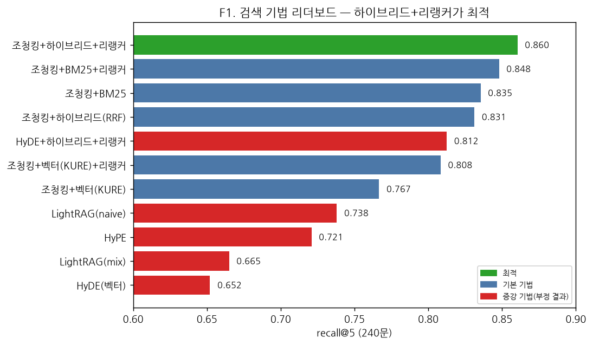
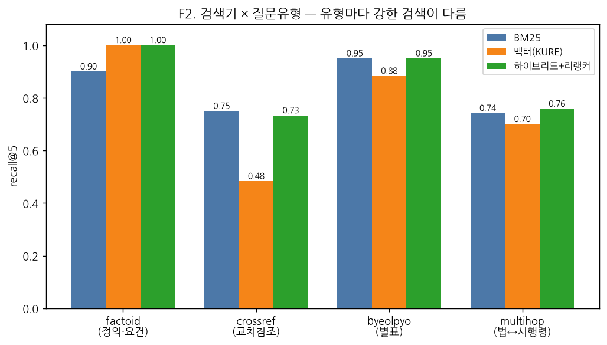
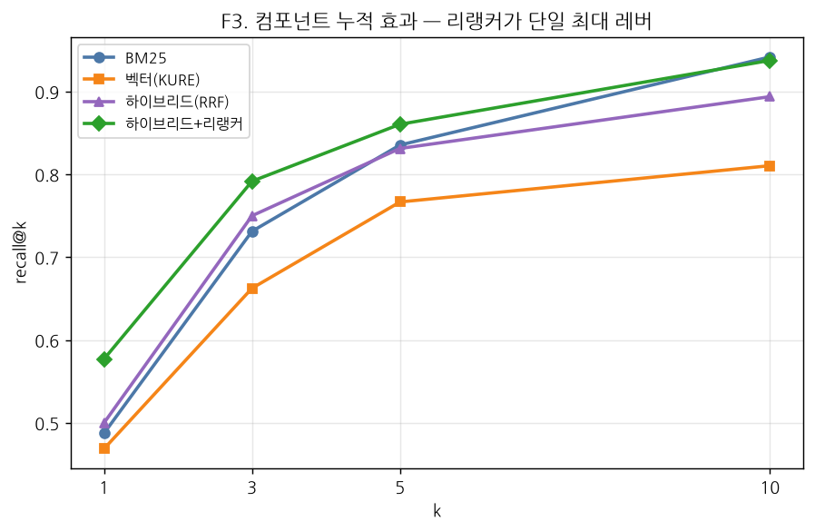
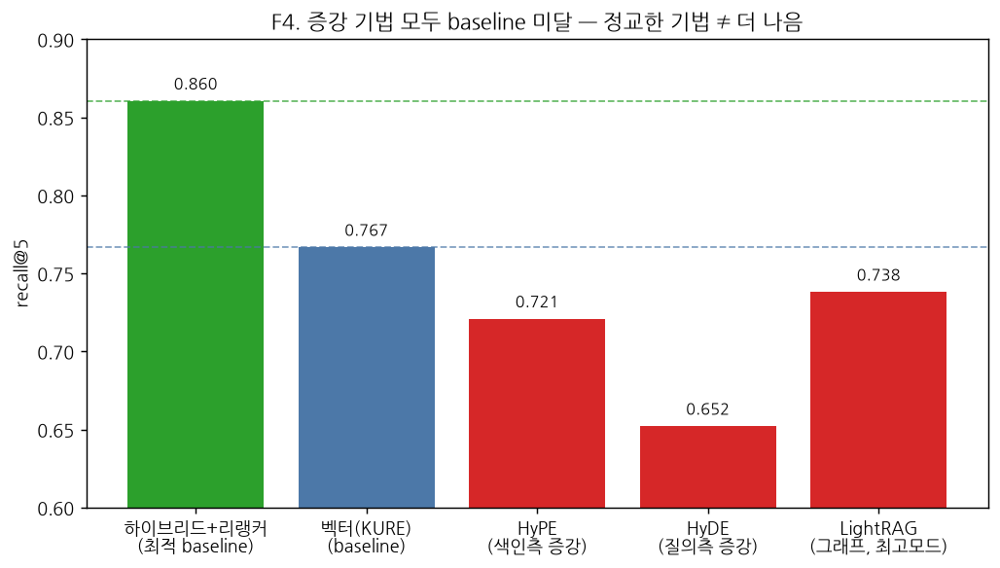
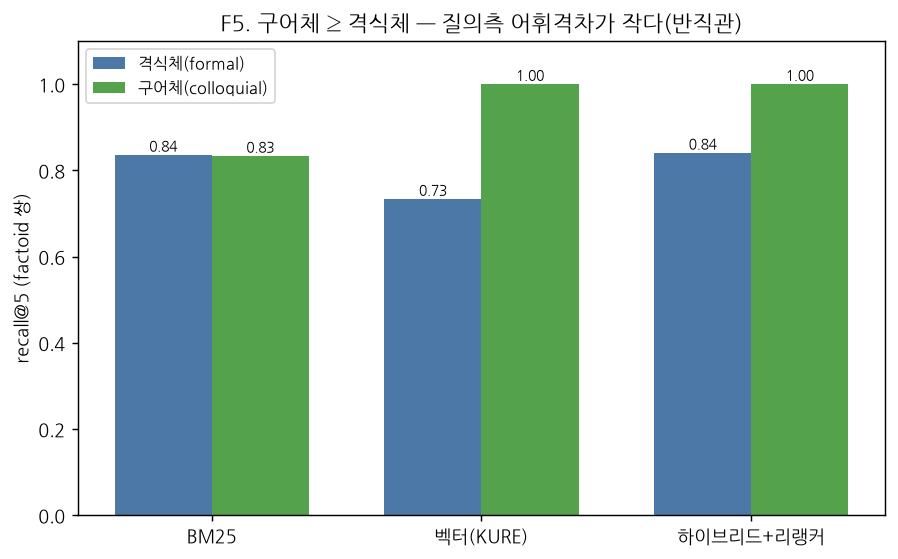
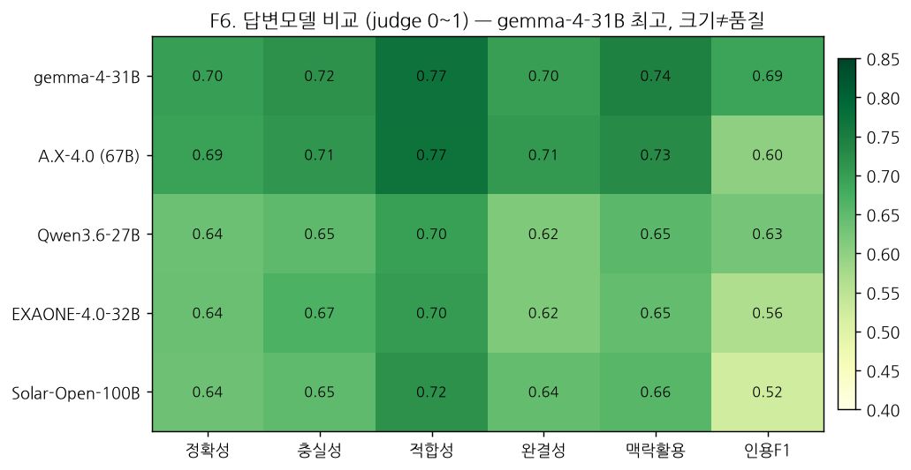

# KA-013-KFinLaw-MCP

금융 법령을 테스트베드로 **한국어 RAG 검색 기법을 정량 비교**하고(→ 사내 규정 RAG로 전이),
**국가법령정보센터 연계 MCP/CLI**를 구축하는 KFTC 연구 과제.

`최종 업데이트 2026-06-14`

[개요](#개요) · [현황](#현황) · [핵심 결과](#핵심-결과) · [빠른 시작](#빠른-시작) · [벤치마크 설계](#벤치마크-설계) · [모델·서빙](#모델서빙) · [답변 평가](#답변-평가) · [데이터·구조](#데이터구조) · [References](#references)

---

## 개요

| | 목적 | 방향 |
|---|---|---|
| 1 | RAG 최적화 기법 시범 — 금융 법령은 테스트베드, 적용 대상은 **사내 규정 RAG** | 기법별 비교 실험 우선. 산출물은 시스템이 아니라 **전이 가능한 기법의 정량 검증·문서화** |
| 2 | 국가법령정보센터 **MCP/CLI** (Claude 호환) | `law.go.kr` 라이브 API(검색·조문·별표·인용검증), 경량·신선도 우선 |

작업 순서는 벤치마크(목적1) → MCP/CLI(목적2). 원칙은 **정석** — 공식 레시피·재현 가능 환경, 임시 우회 지양.

---

## 현황

| 단계 | 상태 |
|---|---|
| 법령 수집 (Open API) | ✅ 2,596건 목록 / 본문 XML 2,582 |
| 금융 범위 확정 | ✅ 키워드 1차(200) + 직접참조 = 931건 |
| 별표 PDF 다운로드·변환 | ✅ 1,083개(실패 0) + kordoc 마크다운 |
| 대표 코퍼스 | ✅ 핵심 금융법 32개(13군, 조문 3,609·별표 126) |
| 골드셋 (반자동) | ✅ 240문 (Mistral Small 4 + 일관성 필터) |
| 검색 실험 E1·E2·E3·E4·E5 | ✅ 결과 ↓ |
| E6 LightRAG 그래프 | ✅ 5개 모드 평가 완료 (결과 ↓) |
| E7 HyDE (질의측 증강) | ✅ 실행 완료 — 부정 결과 (결과 ↓) |
| 답변 평가 (레이어2) | ✅ 5개 답변모델 평가 완료 (결과 ↓) |
| 목적2 MCP/CLI | ⬜ 대기 |

---

## 핵심 결과

검색 실험은 한 번에 한 변수만 바꿔 비교한다 — E1 청킹 · E2 임베딩 · E3 검색기+리랭커 · E4 별표소스 · E5 HyPE · E6 그래프 · E7 HyDE.
(인용 표기는 본문 곳곳 + 하단 [References](#references).)
셋업: 코퍼스 32법령(~3,251 청크), 골드셋 240문(factoid·crossref·byeolpyo·multihop 각 60), gold = 조문/별표 uid.

**리더보드** — 전체 240문, recall@5 / MRR / nDCG@10

| 구성 | recall@5 | MRR | nDCG@10 |
|---|---|---|---|
| 조청킹 + 하이브리드(BM25+KURE) + 리랭커 🏆 | **0.860** | **0.775** | **0.793** |
| 조청킹 + BM25 + 리랭커 | 0.848 | 0.765 | 0.781 |
| 조청킹 + BM25 | 0.835 | 0.707 | 0.741 |
| 조청킹 + 하이브리드(RRF) | 0.831 | 0.710 | 0.735 |
| 조청킹 + 하이브리드 + HyDE + 리랭커 | 0.812 | 0.743 | 0.750 |
| 조청킹 + 벡터(KURE-v1) + 리랭커 | 0.808 | 0.748 | 0.751 |
| 조청킹 + 벡터(KURE-v1) | 0.767 | 0.656 | 0.672 |
| LightRAG 그래프 (naive 모드·최고) | 0.738 | 0.639 | 0.648 |
| 조청킹 + HyPE | 0.721 | 0.622 | 0.637 |
| LightRAG 그래프 (mix 모드) | 0.665 | 0.606 | 0.616 |
| 조청킹 + 벡터 + HyDE | 0.652 | 0.558 | 0.572 |


> **그림 1.** 검색 기법 리더보드(recall@5). 하이브리드+리랭커가 최적이고, 정교한 증강 기법(HyPE·HyDE·LightRAG, 빨강)은 모두 단순 baseline 아래.

**실험 요약**

| 실험 | 결과 |
|---|---|
| E1 청킹 | 조(條) 단위가 BM25·벡터 양쪽 최고 (fixed는 벡터에 불리, parent-doc는 벡터 랭킹 개선) |
| E2 임베딩 | KURE-v1 > KoE5 > BGE-M3 (한국어 특화 우위) |
| E3 검색기 🏆 | 하이브리드(RRF, Cormack 2009)+리랭커(Nogueira & Cho 2019)가 최적. 리랭커가 단일 최대 레버 — crossref 0.48 → 0.73 |
| E4 별표소스 | kordoc-md vs 평문(BM25): 별표 recall@5 **0.950 vs 0.900** — 표구조 보존이 +5pp. 단 MRR·nDCG는 동급이라 평문도 경쟁력 |
| E5 HyPE ❌ | 부정 결과: 0.721 < 원문 0.767 (가설질문이 노이즈, crossref 0.35로 붕괴). HyPE=Vake et al. 2025 |
| E6 LightRAG ❌ | 그래프 RAG(Guo et al. 2024)가 하이브리드+리랭커(0.860)에 크게 미달. 최고 naive(0.738) < 단일 벡터(0.767), 그래프 모드는 naive보다 낮음 — crossref·multihop에도 이득 없음 |
| E7 HyDE ❌ | 부정 결과: 질의측 증강(질문→가설답변 임베딩, Gao et al. 2023)이 오히려 악화. vector 0.767→0.652(−11.5pp), 하이브리드+리랭커 0.860→0.812(−4.8pp). 가설답변이 어휘 드리프트(특히 crossref) |

| | |
|---|---|
|  |  |

> **그림 2·3.** (좌) 검색기 × 질문유형 — factoid는 dense, crossref·별표는 BM25가 강함. (우) 컴포넌트 누적 recall@k — 리랭커가 단일 최대 레버.


> **그림 4.** 색인측(HyPE)·질의측(HyDE)·그래프(LightRAG) 증강이 모두 baseline 미달 — "정교한 기법 ≠ 더 나음".

<details>
<summary>검색기 × 질문유형 · 반직관적 발견 · 사내 전이 권고</summary>

#### 검색기 × 질문유형 (조청킹, recall@5)
| 유형 | BM25 | 벡터(KURE) | 해석 |
|---|---|---|---|
| factoid | 0.900 | 1.000 | 의미 질문은 dense 우위 |
| crossref | 0.750 | 0.483 | 법령명 어휘 매칭 → BM25 강함 (최난도) |
| byeolpyo | 0.950 | 0.883 | 별표 수치·항목 |
| multihop | 0.742 | 0.700 | 본법+시행령 2-gold |

#### LightRAG (E6) 모드별 (recall@5 / MRR / nDCG@10)
| 모드 | recall@5 | MRR | nDCG@10 |
|---|---|---|---|
| naive (벡터only) | 0.738 | 0.639 | 0.648 |
| mix | 0.665 | 0.606 | 0.616 |
| hybrid | 0.644 | 0.593 | 0.597 |
| global | 0.585 | 0.554 | 0.558 |
| local | 0.463 | 0.430 | 0.430 |

그래프 증강 모드(local/global/hybrid/mix)가 모두 naive보다 낮다 — 엔티티 그래프가 chunk recall을 오히려 희석. 교차참조·멀티홉에서도 기대한 그래프 이득이 없었다(crossref 최고 0.467 vs BM25 0.750). (LightRAG 자체 청킹 1200자 + uid 역매핑 근사로 일부 과소평가 가능하나, 격차가 커 결론은 견고.)

#### 반직관적 발견

> **그림 5.** 구어체 ≥ 격식체 — 질의측 어휘격차가 작아 HyPE·HyDE 증강이 무의미함을 예측.

- 구어체 ≥ 격식체로 검색이 더 쉬움 (벡터 KURE: 격식 0.733 vs 구어 1.000) — 구어가 짧고 직접적이라 의미 매칭 용이.
- 이 결과가 HyPE 무용을 예측한다 — 메울 어휘격차가 없는데 HyPE는 그 격차를 메우는 기법.
- HyPE·HyDE·LightRAG **세 증강 기법 모두 부정 결과** — 가설질문(색인측)·가설답변(질의측)·지식그래프 어느 것도 잘 튜닝된 하이브리드+리랭커를 못 이김.
- 교훈: "가정 말고 실측". 논문상 이득이 도메인 전이가 안 됨 → 사내 규정 RAG에서도 도입 전 실측 필수.

#### 사내 규정 RAG 전이 권고
1. 조항/섹션 단위 청킹 + 하이브리드(BM25+dense) + 리랭커를 기본으로.
2. BM25는 강력한 베이스라인(규정은 명칭·번호·표 어휘 많음), dense는 의미 질문 보완, 리랭커는 거의 항상 이득.
3. 한국어 임베딩은 KURE-v1. 교차참조(규정 간 인용)는 그래프/하이브리드로 별도 보완.

</details>

---

## 빠른 시작

벤치마크는 `benchmark` 패키지 — repo 루트에서 `python -m benchmark.<모듈>`로 실행(데이터 수집기는 `python scripts/<파일>.py`).

```bash
# 1) 데이터 (대용량은 스크립트로 재생성)
export LAW_OC=<본인_인증키>                       # 국가법령정보센터 OC (발급법 ↓)
python scripts/collect_laws.py
python scripts/download_byeolpyo.py --kinds 별표

# 2) 코퍼스 + 골드셋  (vLLM 기동: scripts/serve_model.sh mistral)
python -m benchmark.corpus
python -m benchmark.goldset.build_goldset --reasoning-effort none --no-judge

# 3) 검색 실험
python -m benchmark.retrieval_runner --chunker article --retriever hybrid --rerank \
    --embedder kure-v1 --byeolpyo md              # 최적 구성 (recall@5 0.860)
python -m benchmark.retrieval_runner --chunker article --hype --embedder kure-v1 --byeolpyo md   # E5
python -m benchmark.retrieval_runner --chunker article --retriever vector --embedder kure-v1 --byeolpyo md   # E1~E2 baseline
#  (E4 별표소스) --byeolpyo md vs --byeolpyo plain

# E7 HyDE (질의측): Mistral로 가설답변 캐시 생성 후 vector/hybrid에 적용
python -m benchmark.hyde_gen --reasoning-effort none
python -m benchmark.retrieval_runner --chunker article --retriever vector --hyde --embedder kure-v1 --byeolpyo md

# 4) E6 LightRAG (GPU 전용 권장 — CUDA graph + 동시성↑로 가속)
EAGER=0 GPU_UTIL=0.7 scripts/serve_model.sh mistral
python -m benchmark.lightrag_index               # 전체 색인 (가속 시 ~80분)
python -m benchmark.lightrag_eval --modes naive local global hybrid mix

# 5) 답변 평가 (답변모델 + 독립 judge 서빙 후)
python -m benchmark.answer_runner --answer-model LGAI-EXAONE/EXAONE-4.0-32B \
    --judge-base-url http://localhost:8001/v1 --judge-model openai/gpt-oss-120b
```

환경 재현: `serving/requirements.venv.full.lock` (vllm 0.23.0 등) + sentence-transformers 5.5.1 / KURE-v1.

---

## 벤치마크 설계

2계층 평가 파이프라인 — 검색(레이어1)을 먼저 최적화·고정한 뒤 답변 생성(레이어2)을 평가한다.

```mermaid
flowchart LR
  X[법령 XML · 별표 PDF] --> C[코퍼스 32법령<br/>~3,251 청크]
  C --> G[골드셋 240문<br/>LLM 생성 + 일관성 필터]
  G --> L1{{레이어1 · 검색 평가}}
  L1 -->|청킹·임베딩·검색기·리랭커<br/>HyPE·HyDE·LightRAG| M1[recall@k · MRR · nDCG<br/>gold = 조문/별표 uid]
  M1 -->|최적 config 고정| L2{{레이어2 · 답변 평가}}
  L2 -->|답변모델 생성 → judge + 인용검증| M2[정확성·충실성·적합성<br/>완결성·맥락활용·인용]
```
> **그림 0.** 방법론 개요. 변수는 한 번에 하나씩만 바꿔(OFAT) 기법별 효과를 격리한다.

**코퍼스** — 핵심 금융법 32개(13군). 법↔시행령 멀티홉·별표 조회·교차참조를 모두 평가하도록 통제된 소규모 구성.

**골드셋** — 240문, 반자동.
- Mistral Small 4로 조문/별표에서 Q&A 생성 → 일관성(round-trip BM25) 필터로 채택.
- 유형 4종 균형(각 60): factoid · crossref · byeolpyo · multihop.
- factoid는 격식↔구어 30쌍(공통 gold·pair_id) → 어휘격차 짝지어 측정.
- 무결성: gold_id 300개 전부 코퍼스 존재, 멀티홉 60문은 2-gold(본법+시행령).

**비교 축** — 일변수 격리(OFAT), 질문유형·register(격식/구어)별 분해, 품질×운영비용 동시 평가.

| 축 | 변수 | 상태 |
|---|---|---|
| A 파싱 | 별표소스(kordoc-md/평문/MinerU)·노이즈 제거 | ✅ E4(md vs 평문) · MinerU 미연결 |
| B 청킹 | 조/항/고정토큰/계층(parent-doc)·브레드크럼 | ✅ E1 |
| C 임베딩 | KURE-v1 / BGE-M3(Chen 2024) / KoE5(E5, Wang 2022) | ✅ E2 |
| D 검색 | BM25(Robertson 2009) / dense(Karpukhin 2020) / 하이브리드(RRF, Cormack 2009) / LightRAG(Guo 2024) | ✅ E3 · ✅ E6 |
| E 질의·색인변환 | HyPE 색인측(Vake 2025) · HyDE 질의측(Gao 2023) | ✅ E5(HyPE) · ✅ E7(HyDE) |
| F 재순위 | bge-reranker-v2-m3 | ✅ E3 |
| G 생성 | 컨텍스트 포맷·인용 지시 | 🟢 답변 평가 |
| H 운영 | 지연·빌드시간·비용·메모리 | ✅ timing |

**메트릭** (`benchmark/eval/`)
- 검색 평가 — recall@k · precision@k · MRR · nDCG@k(Järvelin & Kekäläinen 2002). gold = uid 결정론 채점.
- 답변 평가 — 인용정확도(자동) + judge 루브릭 5종 (↓ 답변 평가 절).

<details>
<summary>골드셋 방법론 근거</summary>

- 검색 골드셋은 오픈웨이트 생성기로 충분(InPars, Bonifacio 2022; InPars-v2, Jeronymo 2023) — gold이 ID라 LLM-judge 편향과 무관.
- 생성기·judge·답변모델을 다른 계열로 분리해 오염(preference leakage) 회피.
- 핵심 품질장치는 일관성 필터(Promptagator, Dai 2023) — 생성 질문을 검색기에 넣어 원본 조문이 회수되는 질문만 채택.
- BM25는 구어체를 과소평가할 수 있어, factoid 쌍은 격식체로 일관성 검사하고 구어체는 같은 정답을 공유하므로 함께 채택.

</details>

---

## 모델·서빙

3개 역할을 서로 다른 계열로 분리한다(생성·judge가 답변모델과 같으면 self-enhancement·preference leakage). 전 구간 temp=0.

| 역할 | 모델 | 비고 |
|---|---|---|
| 골드셋 생성기 | Mistral Small 4 (119B) | 독립 계열, 한국어 우수(별표도 한국어 유지) |
| judge | gpt-oss-120b | 생성기·답변모델과 다른 계열 |
| 답변모델 (답변 평가) | A.X-4.0 · Solar-Open · EXAONE-4.0 · Gemma 4 · Qwen3.6 | 사내 실사용 후보(평가 대상) |

서빙은 전용 venv `/home/work/kftc_model/kfinlaw-serve`(시스템 비오염)에서 `scripts/serve_model.sh {mistral|gptoss|stop}`.

<details>
<summary>서빙 플래그·격리·GPU 설정</summary>

- 버전 박제: vllm 0.23.0 · mistral_common 1.11.3 (시스템 0.20.1/1.11.2의 reasoning_effort·멀티모달 버그 회피). `serving/requirements.venv.lock`.
- 격리: 셸 `PYTHONPATH`가 시스템 패키지를 오염시키므로 `env -u PYTHONPATH PYTHONNOUSERSITE=1` (serve_model.sh가 자동 적용 + 잔여 워커/shm 정리).
- Mistral 플래그: `--quantization fp8 --reasoning-parser mistral --tool-call-parser mistral --enable-auto-tool-choice --limit-mm-per-prompt '{"image":0}'`, 요청 시 `reasoning_effort="none"`.
- GPU: FP8 + ctx 4096 + `--gpu-memory-utilization`(학습 공존 0.26 / GPU 전용 `GPU_UTIL=0.7`). 디코딩 가속은 `EAGER=0`(CUDA graph), 기본 `EAGER=1`(enforce-eager, 메모리 절약·재현).

</details>

---

## 답변 평가

검색 평가가 "맞는 조문을 찾았는가"라면 답변 평가는 "답이 정확·충실한가". 골드셋·코퍼스·검색기를 재사용하고 생성+채점만 얹는다.

파이프라인(`benchmark/answer_runner.py`): ① 검색(최적 검색 config 고정) → ② 답변 생성(답변모델, 근거 번호 인용) → ③ 채점(judge + 자동 인용검증).
검색 config는 `config.yaml › answer_eval`에 고정해 답변모델 효과만 격리하고, `--retrieval {good,bad,none}`로 검색품질 전이·closed-book 대조를 한 러너에서 수행.

**메트릭** (`benchmark/eval/answer_metrics.py`, RAGAS 정렬 — Es et al. 2024)

| 메트릭 | 측정 | 채점 |
|---|---|---|
| faithfulness | 답이 회수 컨텍스트에 근거(환각 없음) | judge |
| answer correctness | 정답과 일치 | judge (레퍼런스 기반: 정답+정답조문 제공) |
| answer relevancy | 질문에 답하는가 | judge |
| completeness | 요건/항목 누락 없는가 | judge |
| context utilization | 회수 컨텍스트를 실제 활용 | judge |
| citation accuracy | 인용 조문이 gold_ids와 일치 | 자동 (LLM 불필요) |

judge는 gpt-oss-120b(답변모델과 다른 계열), temp=0. 인용정확도만 자동·객관, 나머지는 레퍼런스 기반 judge.

**결과 — 답변모델 5종** (검색=하이브리드+리랭커 고정, 240문, judge 0~1)

| 답변모델 | 정확성 | 충실성 | 적합성 | 완결성 | 맥락활용 | 인용F1 |
|---|---|---|---|---|---|---|
| **google/gemma-4-31B** 🏆 | **0.70** | 0.72 | 0.77 | 0.70 | 0.74 | **0.69** |
| skt/A.X-4.0 (67B) | 0.69 | 0.71 | 0.77 | 0.71 | 0.73 | 0.60 |
| LGAI-EXAONE-4.0-32B | 0.64 | 0.67 | 0.70 | 0.62 | 0.65 | 0.56 |
| Qwen/Qwen3.6-27B | 0.64 | 0.65 | 0.70 | 0.62 | 0.65 | 0.63 |
| upstage/Solar-Open-100B (96B) | 0.64 | 0.65 | 0.72 | 0.64 | 0.66 | 0.52 |


> **그림 6.** 답변모델 비교. **gemma-4-31B가 전 메트릭 최상위**이고 A.X-4.0이 근접. **31B가 96B(Solar)·67B(A.X)를 능가** — 모델 크기보다 도메인 적합성이 중요(검색 실험의 "정교≠우위"와 같은 교훈).

> **사내 적용 시사**: 답변모델은 무작정 큰 모델이 아니라 한국어·도메인 적합 중형(예: gemma-4-31B급)을 후보로, 동일 검색·프롬프트에서 실측 비교해 선정한다.

<details>
<summary>RAGAS 대응 · 비교 축 · 엄밀성</summary>

#### RAGAS 대응 (정렬했으나 라이브러리 비채택)
RAGAS는 RAG 평가의 사실상 표준(reference-free LLM 자동채점). 우리 메트릭은 그 분류에 의도적으로 정렬하되, gold(정답·정답조문 uid)를 보유해 레퍼런스 기반으로 더 엄밀히 채점하고 judge 계열을 강제 분리하며 조문 uid 인용검증·한국어 프롬프트를 직접 통제하기 위해 라이브러리는 쓰지 않고 직접 구현했다.

| 우리(`answer_metrics`) | RAGAS | 차이 |
|---|---|---|
| faithfulness / answer relevancy / context utilization | 동일 | 동일 개념 |
| answer correctness | answer correctness | 둘 다 레퍼런스 필요 |
| completeness | (표준 없음, context recall 근접) | 커스텀 |
| citation accuracy | (없음) | 조문 uid 일치, 자동·도메인 특화 |

검색 평가의 recall@k·nDCG는 uid 기반 결정론 채점이라 RAGAS의 LLM 판정 context precision/recall보다 객관적이다. 외부 타당성 교차검증이 필요하면 골드셋 일부에 RAGAS를 별도 비교축으로 1회 돌릴 수 있다.

#### 고유 비교 축
1. 답변모델 5종 비교 — 동일 검색·프롬프트에서 최고 RAG 답변(사내 모델 선정 근거).
2. 검색품질 → 답변품질 전이 — 하이브리드+리랭커 vs 단일 BM25 top-1.
3. closed-book 대조 — 컨텍스트 없이 vs RAG (RAG 실효·환각 누출 점검; RAG=Lewis et al. 2020).
4. 프롬프트 변형 — 인용지시·컨텍스트 포맷·거부유도.

유형별·register별로 분해.

#### 엄밀성
- judge 독립성: 답변모델과 다른 계열(같으면 자기우대 +10~25%). 결과는 답변모델별 분리 보고.
- 레퍼런스 기반 채점: judge에 정답+정답조문 제공 → 자기지식 의존↓.
- 인간(법률가) 표본 검수 ~150문 + 일치계수(κ) 보고 (ARES, Saad-Falcon 2024; KBL, Kim et al. 2024 관행).
- 보류 유형: 시행일자 버전 검색(연혁 데이터 필요), no-answer(기권 메트릭 필요) — 목적2 MCP와 함께.
- 진행 시점: E6까지 검색 최적 config 확정 후 착수(검색이 흔들리면 검색·생성 효과 분리 불가).

</details>

---

## 데이터·구조

**데이터 파이프라인** (수집 → 필터 → 전처리 → 별표)
1. 수집(`collect_laws.py`): 금융 키워드 28개 → 현행 200건 → 참조 재귀 → 2,596건(XML 2,582).
2. 금융 범위: 키워드 1차 + 직접참조 = 931건(재귀로 들어온 비금융 제외).
3. 조문 전처리(`lawdoc.py`): XML → 조 단위 청크. uid = `{법령ID}-{조문번호:04d}{-가지}` / 별표 `{법령ID}-별표{번호}{-가지}`.
4. 별표: PDF가 정답(API HTML은 JS iframe이라 스크래핑 불가, 원본 HWP는 표 구조 퇴화). 변환은 kordoc(PDF 모드)가 최적(GPU 불필요, MIT), 복잡 병합셀은 MinerU 폴백. 1,083개 전수 변환.

<details>
<summary>디렉토리 구조</summary>

```
KA-013-KFinLaw-MCP/
├── README.md
├── config.yaml                    # 단일 설정 출처(서빙·모델·검색·골드셋·답변 평가)
├── scripts/
│   ├── collect_laws.py            # 법령 수집(3단계)
│   ├── download_byeolpyo.py       # 별표 PDF 전수 다운로드(멱등)
│   ├── hwp2pdf.sh                 # HWP→PDF (LibreOffice+H2Orestart)
│   └── serve_model.sh             # vLLM 서빙(venv 격리·공식 플래그·정리)
├── benchmark/                     # python -m benchmark.<모듈>
│   ├── common.py                  # config 로드 + 공유 유틸·LLM 클라이언트
│   ├── lawdoc.py · corpus.py      # 파서(조문/별표→uid) · 코퍼스 선정
│   ├── pipeline/                  # chunkers · embedders · retrievers
│   ├── eval/                      # retrieval_metrics(검색) · answer_metrics(답변)
│   ├── goldset/                   # build_goldset · questions.jsonl · spotcheck
│   ├── retrieval_runner.py        # 검색 평가
│   ├── answer_runner.py           # 답변 평가
│   ├── hype_index.py              # HyPE 색인측 증강(E5)
│   ├── hyde_gen.py                # HyDE 질의측 증강 캐시(E7)
│   ├── lightrag_index.py · lightrag_eval.py   # LightRAG(E6)
│   └── reports/  (gitignore)      # 실험 결과 JSON
├── serving/  requirements.venv.lock / .full.lock   # 작동 버전 박제
├── data/     (gitignore)          # raw_xml · byeolpyo_pdf · byeolpyo_md
└── tools/    (gitignore)          # LibreOffice + H2Orestart 로컬 설치
```

</details>

**데이터 소스 · 인증키** — 국가법령정보센터 Open API (https://open.law.go.kr)
- 검색 `lawSearch.do` / 본문 `lawService.do` / 별표서식 `target=licbyl`.
- 인증키(OC)는 사용자별 발급·설정(하드코딩 안 함): 회원가입 → OPEN API 신청 → 발급 → `export LAW_OC=<키>` 후 실행.

---

## References

본 벤치마크가 채택·검증한 기법의 원천. (본문 인용은 (저자 연도) 형식.)

**RAG · 검색 · 랭킹**
- Lewis et al. (2020). *Retrieval-Augmented Generation for Knowledge-Intensive NLP Tasks.* NeurIPS. [arXiv:2005.11401](https://arxiv.org/abs/2005.11401)
- Robertson & Zaragoza (2009). *The Probabilistic Relevance Framework: BM25 and Beyond.* Foundations and Trends in IR. [doi:10.1561/1500000019](https://doi.org/10.1561/1500000019)
- Karpukhin et al. (2020). *Dense Passage Retrieval for Open-Domain Question Answering.* EMNLP. [arXiv:2004.04906](https://arxiv.org/abs/2004.04906)
- Cormack, Clarke & Büttcher (2009). *Reciprocal Rank Fusion Outperforms Condorcet and Individual Rank Learning Methods.* SIGIR. [doi:10.1145/1571941.1572114](https://doi.org/10.1145/1571941.1572114)
- Nogueira & Cho (2019). *Passage Re-ranking with BERT.* [arXiv:1901.04085](https://arxiv.org/abs/1901.04085)

**임베딩 · 리랭커 모델**
- Wang et al. (2022). *Text Embeddings by Weakly-Supervised Contrastive Pre-training* (E5; KoE5 기반). [arXiv:2212.03533](https://arxiv.org/abs/2212.03533)
- Chen et al. (2024). *BGE M3-Embedding: Multi-Lingual, Multi-Functionality, Multi-Granularity Text Embeddings* (BGE-M3 · bge-reranker-v2-m3). [arXiv:2402.03216](https://arxiv.org/abs/2402.03216)
- NLP&AI Lab, Korea Univ. *KURE-v1 / KoE5* (한국어 검색 임베딩). [huggingface.co/nlpai-lab/KURE-v1](https://huggingface.co/nlpai-lab/KURE-v1)

**질의·색인 변환 / 그래프 RAG**
- Gao et al. (2023). *Precise Zero-Shot Dense Retrieval without Relevance Labels* (HyDE, E7). ACL. [arXiv:2212.10496](https://arxiv.org/abs/2212.10496)
- Vake, Vičič & Tošić (2025). *Bridging the Question-Answer Gap in RAG: Hypothetical Prompt Embeddings* (HyPE, E5). [SSRN:5139335](https://papers.ssrn.com/sol3/papers.cfm?abstract_id=5139335) · 구현: [NirDiamant/RAG_Techniques](https://github.com/NirDiamant/RAG_Techniques)
- Guo et al. (2024). *LightRAG: Simple and Fast Retrieval-Augmented Generation* (E6). [arXiv:2410.05779](https://arxiv.org/abs/2410.05779)

**골드셋 생성 (합성 질의)**
- Bonifacio et al. (2022). *InPars: Data Augmentation for Information Retrieval using LLMs.* SIGIR. [arXiv:2202.05144](https://arxiv.org/abs/2202.05144)
- Jeronymo et al. (2023). *InPars-v2: Large Language Models as Efficient Dataset Generators for IR.* [arXiv:2301.01820](https://arxiv.org/abs/2301.01820)
- Dai et al. (2023). *Promptagator: Few-shot Dense Retrieval From 8 Examples.* ICLR. [arXiv:2209.11755](https://arxiv.org/abs/2209.11755)

**평가**
- Järvelin & Kekäläinen (2002). *Cumulated Gain-based Evaluation of IR Techniques* (nDCG). ACM TOIS. [doi:10.1145/582415.582418](https://doi.org/10.1145/582415.582418)
- Es et al. (2024). *RAGAS: Automated Evaluation of Retrieval Augmented Generation.* EACL. [arXiv:2309.15217](https://arxiv.org/abs/2309.15217)
- Saad-Falcon et al. (2024). *ARES: An Automated Evaluation Framework for Retrieval-Augmented Generation.* NAACL. [arXiv:2311.09476](https://arxiv.org/abs/2311.09476)
- Kim et al. (2024). *Developing a Pragmatic Benchmark for Assessing Korean Legal Language Understanding in LLMs* (KBL). EMNLP Findings. [arXiv:2410.08731](https://arxiv.org/abs/2410.08731)
